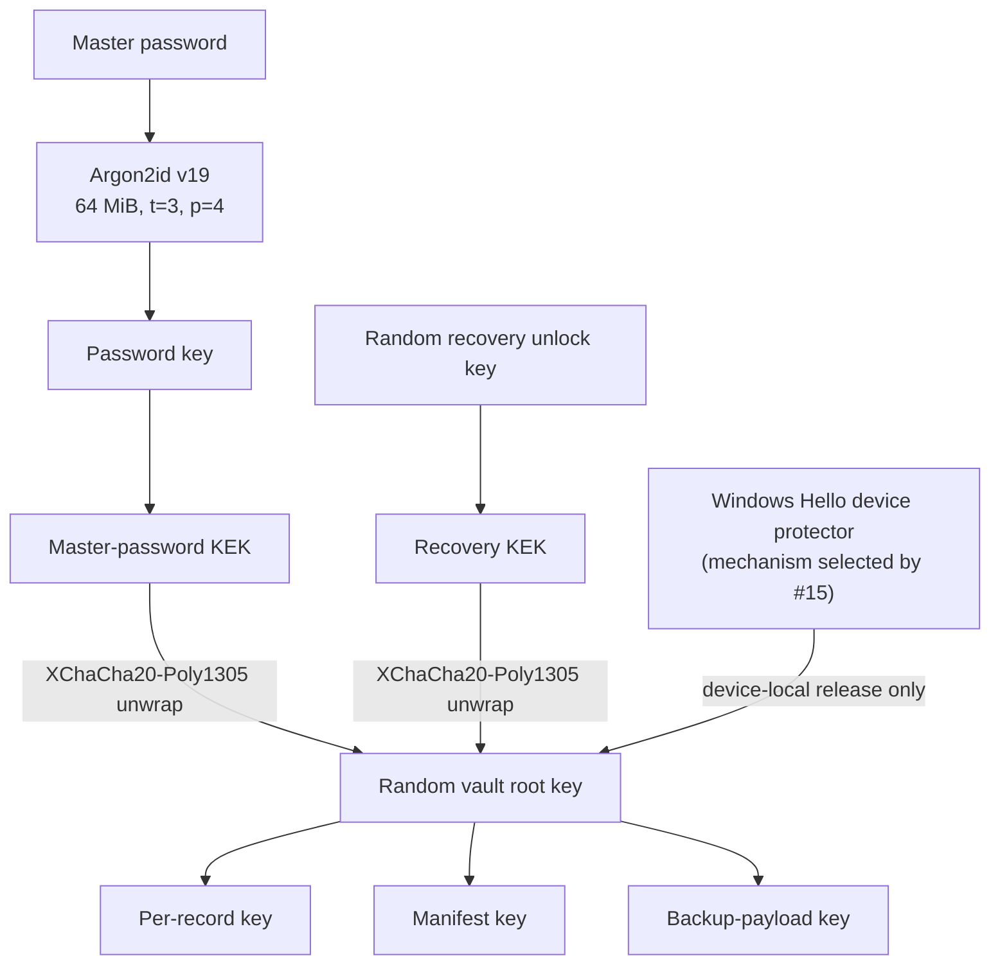

# ADR 0005: Vault Key Hierarchy and Encrypted Record Format

**Status:** Proposed — independent review required before acceptance
**Date:** 2026-07-23
**Specification version:** 1.0
**Scope:** Windows MVP vault creation, unlock, encrypted records, backup framing, migration, and corruption behavior
**Decision issue:** [#9](https://github.com/theundeadmonk/Librarian/issues/9)
**Security baseline:** [[Threat Model]]

## Context

Librarian needs a portable vault format that remains recoverable after device
loss without making the master password the long-lived data-encryption key.
The format must tolerate hostile files, interrupted writes, cloud replay, and
future algorithm changes while keeping everyday Windows Hello unlock
device-local.

The accepted architecture assigns all cryptographic operations and decrypted
record handling to the Rust vault agent. This decision preserves that boundary.
It does not enable credential storage in the current scaffold. Acceptance,
implementation, deterministic vectors, and the independent review gate below
must all complete before `FormatReadiness::ScaffoldOnly` can change.

The supporting [security hardening review](../security/hardening/issue-9/hardening.md)
compares the serious alternatives. The selected design uses record-level
XChaCha20-Poly1305 envelopes and an encrypted manifest. AES-256-GCM with a
counter allocator was rejected because a lost or reused counter can
catastrophically reuse a nonce. AES-256-GCM-SIV remains attractive, but the
current stable RustCrypto implementation states that it has never received a
security audit. That tradeoff can be revisited through a new cipher-suite
version after independent review.

## Decision summary

1. Generate a random 256-bit vault root key (VRK). Never derive the VRK from a
   password.
2. Derive purpose-specific keys from the VRK with HKDF-SHA-256 and explicit
   versioned domain labels.
3. Derive a master-password wrapping key with Argon2id, then use it to wrap the
   VRK. A random 256-bit recovery unlock key independently wraps the same VRK.
   Either the master password or the recovery key can restore a backup alone.
4. Treat Windows Hello as a device-local convenience protector for the VRK,
   never as recovery material. The concrete platform mechanism remains blocked
   on [#15](https://github.com/theundeadmonk/Librarian/issues/15).
5. Encrypt records, the manifest, and backup payloads with
   XChaCha20-Poly1305 using fresh random 192-bit nonces and authenticated,
   deterministic CBOR metadata.
6. Store only opaque encrypted record envelopes in SQLite. An encrypted
   manifest commits to the complete active record set so deletion, insertion,
   substitution, and partial replay fail closed.
7. Make rollback detectable relative to a device's last authenticated
   generation. A clean device cannot prove that a supplied backup is the
   newest backup; the product must say so rather than claim rollback-proof
   storage.
8. Perform migrations copy-on-write. Authentication, corruption, unsupported
   versions, interrupted migration, and unsafe resource requests never produce
   a partially unlocked vault.

## Serialized suites and pinned implementations

### Serialized suite identifiers

The following identifiers are serialized in the vault and backup formats. They
are protocol values, not Rust enum discriminants, and readers reject unknown
values.

| On-disk identifier | Version 1 value | Construction | Initial Rust implementation |
|---|---:|---|---|
| `kdf_suite` | `1` | Argon2id version `0x13` | `argon2` 0.5.3 with `zeroize` |
| `key_schedule` | `1` | HKDF-SHA-256 | `hkdf` 0.13.0 and `sha2` 0.11.0 |
| `aead_suite` | `1` | XChaCha20-Poly1305, 256-bit key, 192-bit nonce, 128-bit tag | `chacha20poly1305` 0.11.0 with `zeroize` |
| `encoding` | `1` | Deterministic CBOR profile defined below | `minicbor` 2.2.3 |
| `digest_suite` | `1` | SHA-256 | `sha2` 0.11.0 |

### Non-serialized implementation pins

These choices are required by version 1 but do not add fields to the on-disk
format:

| Area | Version 1 requirement | Initial Rust implementation |
|---|---|---|
| Randomness | Windows operating-system CSPRNG | `getrandom` 0.4.3 |
| Database | SQLite with application-layer encrypted envelopes | `rusqlite` 0.40.1, no default features, with `bundled`, `backup`, and `limits` |
| Secret erasure | Best-effort zeroization on scope exit | `zeroize` 1.9.0 |

Cargo.lock is the exact dependency boundary. A dependency update is a security
change: review release notes and advisories, run conformance and negative
vectors, and record the result in the pull request. Prerelease cryptographic
crates are not permitted. SQLite loadable extensions and SQLCipher are not
enabled.

These libraries reduce implementation risk but do not make the composition
reviewed. The independent review gate applies to Librarian's key schedule,
format, Windows integration, parsing, and failure behavior as a whole.

## Key hierarchy

All binary keys below are exactly 32 bytes.



### Root and unlock keys

- **Vault root key (`VRK`)**: 256 random bits generated once at vault creation.
  It is the only portable root for record, manifest, and backup keys.
- **Password key (`PWK`)**: 256 bits output by Argon2id from the UTF-8 master
  password and a random 16-byte salt. The agent rejects an ill-formed Unicode
  string at the IPC boundary and hashes the exact UTF-8 bytes received; it does
  not apply Unicode normalization or trim whitespace.
- **Master-password key-encryption key (`MP-KEK`)**: HKDF output from `PWK`.
  It wraps only the VRK.
- **Recovery unlock key (`RUK`)**: 256 random bits generated at vault creation.
  It is independent of the master password and device. The future recovery kit
  must encode these exact 32 bytes losslessly with error detection; the
  human-readable representation and confirmation UX are owned by Slice 4.
- **Recovery key-encryption key (`R-KEK`)**: HKDF output from `RUK`. It wraps
  only the VRK.
- **Windows Hello protector**: a device-local, user-verification-gated
  mechanism that releases or unwraps the VRK for the current agent unlock
  attempt. It is never copied into a portable vault or backup.

Master-password change and recovery-key rotation replace only the affected VRK
wrapper, but the wrapper bytes are part of the manifest AAD. The same SQLite
transaction therefore writes the new wrapper and re-encrypts the unchanged
manifest with a fresh nonce under the unchanged VRK; records are not
re-encrypted.

VRK rotation is a separate copy-on-write migration. It generates a new VRK and
key epoch, requires a confirmed master password for a fresh master wrapper,
generates a new recovery unlock key and fresh recovery wrapper, and
re-encrypts the manifest, every active record, and the backup payload. The
rotation never commits unless both new wrappers and the new recovery kit are
available and the complete destination authenticates successfully.

[#15](https://github.com/theundeadmonk/Librarian/issues/15) may choose the
Windows primitive and local storage encoding, but it cannot change this
contract without amending this ADR: the protected object is the current VRK;
its local metadata binds the vault ID, container version, key epoch, and
protector version; user verification occurs inside a system-owned prompt for
every release; cancellation, wrong session, stale completion, corruption, or
agent restart releases nothing; and no local Hello blob is sufficient for
portable restore. If Windows cannot meet that contract against the accepted
local-attacker model, Hello unlock remains disabled rather than becoming a
weaker convenience path.

### Password derivation profile

Version 1 writes exactly:

- algorithm: Argon2id;
- Argon2 version: `0x13`;
- memory cost: `65,536` KiB;
- time cost: `3`;
- parallelism: `4`;
- salt: 16 random bytes;
- output: 32 bytes.

This is RFC 9106's second recommended profile. Librarian does not silently
reduce it after an allocation failure. Before implementation acceptance, #10
must benchmark this profile on the slowest supported Windows 11 baseline and
record median and p95 unlock latency. If it does not satisfy the product's
measured unlock budget, this ADR must be amended; the implementation must not
invent a weaker fallback.

Readers validate KDF metadata before allocation and accept only the exact
version 1 profile. A future profile requires a new `kdf_suite` or profile
identifier and a bounded reader policy. A parameter upgrade rewraps the same
VRK with a fresh salt and nonce after a successful unlock.

### HKDF schedule

HKDF uses SHA-256, the 16-byte `vault_id` as salt, and the source key as input
keying material. `info` is the exact ASCII prefix
`librarian/vault/v1/` followed by the suffix below. Concatenation is literal
byte concatenation. Integers are unsigned, fixed-width big-endian values.

| Output | Input keying material | `info` suffix |
|---|---|---|
| `MP-KEK` | `PWK` | `master-wrap` |
| `R-KEK` | `RUK` | `recovery-wrap` |
| `RecordKey(record_id, key_epoch)` | `VRK` | `record/` + 16-byte `record_id` + 4-byte `key_epoch` |
| `ManifestKey(key_epoch)` | `VRK` | `manifest/` + 4-byte `key_epoch` |
| `BackupKey(key_epoch)` | `VRK` | `backup/` + 4-byte `key_epoch` |

Every expansion is exactly 32 bytes. A label, identifier, epoch, length, or
byte order change requires a new key-schedule version.

## Deterministic CBOR profile

All CBOR structures are fixed-length arrays with fields in the specified
order. Maps, tags, floating-point values, indefinite-length items, duplicate
fields, and trailing bytes are prohibited. Integers and lengths use RFC 8949
deterministic shortest encodings. Text is valid UTF-8; binary values use byte
strings.

The decoder:

1. enforces the size and nesting limits before allocation;
2. rejects any value outside its exact schema;
3. decodes into bounded types;
4. re-encodes the value and requires byte-for-byte equality before using it as
   authenticated metadata or plaintext.

This makes a valid semantic value have one byte representation and gives test
vectors a stable interoperability boundary.

## Vault database format

### SQLite configuration

The agent creates a dedicated SQLite database with a 4,096-byte page size,
WAL journaling, `synchronous=FULL`, foreign keys enabled, trusted schema
disabled, and defensive mode enabled. It disables extension loading. The
database and WAL contain only clear framing and authenticated ciphertext.

The database lives in the product's per-user local data directory under a
restrictive ACL. The agent resolves the directory and file identity itself,
rejects reparse points, opens the live database without sharing write or delete
access when Windows permits, and revalidates file identity across replacement,
backup, restore, and migration. Same-user file access remains a residual
Windows risk; these controls contain accidental or opportunistic replacement
but do not substitute for authentication.

Version 1 has only these application tables:

```sql
CREATE TABLE vault_header (
    singleton INTEGER PRIMARY KEY CHECK (singleton = 1),
    header BLOB NOT NULL
) STRICT;

CREATE TABLE vault_manifest (
    singleton INTEGER PRIMARY KEY CHECK (singleton = 1),
    envelope BLOB NOT NULL
) STRICT;

CREATE TABLE encrypted_records (
    record_id BLOB PRIMARY KEY NOT NULL CHECK (length(record_id) = 16),
    envelope BLOB NOT NULL
) STRICT, WITHOUT ROWID;
```

`record_id` is 16 random bytes. It is not a timestamped UUID and has no
semantic meaning. The agent rejects more than 100,000 records, an envelope
larger than 1 MiB, a header larger than 64 KiB, a manifest envelope larger than
8 MiB, or a database larger than 512 MiB in the Windows MVP. The 8 MiB
manifest bound accommodates 100,000 fixed-size record commitments plus
deterministic CBOR and AEAD overhead. Arithmetic overflow and values outside
these limits fail before allocation.

### Clear vault header

The singleton header is deterministic CBOR:

```text
[
  "LBR-VLT",                 ; text magic
  1,                         ; container_version
  1,                         ; minimum_reader_version
  1,                         ; key_schedule
  1,                         ; aead_suite
  1,                         ; encoding
  1,                         ; digest_suite
  vault_id,                  ; 16 bytes
  key_epoch,                 ; u32
  [
    1, 19, 65536, 3, 4,     ; kdf_suite, Argon2 version, m, t, p
    password_salt,           ; 16 bytes
    master_wrap_nonce,       ; 24 bytes
    wrapped_vrk              ; 48 bytes: 32-byte ciphertext + 16-byte tag
  ],
  [
    1,                       ; recovery_wrapper_version
    recovery_wrap_nonce,     ; 24 bytes
    wrapped_vrk              ; 48 bytes
  ]
]
```

The wrapper AEAD associated data is deterministic CBOR containing the magic,
container and minimum-reader versions, key schedule, AEAD suite, encoding,
digest suite, vault ID, key epoch, wrapper type, wrapper version, and, for the
master wrapper, the complete KDF tuple and salt. A field cannot be changed
without making unwrap fail.

The manifest is stored separately so the bounded header does not grow with the
record count. Its clear envelope is deterministic CBOR:

```text
[
  1,                         ; manifest_envelope_version
  manifest_nonce,            ; 24 bytes
  encrypted_manifest         ; plaintext length + 16-byte tag
]
```

The manifest AEAD associated data is deterministic CBOR containing the complete
clear header, the manifest envelope version, and the manifest nonce. This makes
the manifest authenticate both wrappers and all algorithm-selection metadata
even when the VRK arrived through Windows Hello. Any wrapper change therefore
requires manifest re-encryption in the same transaction.

### Encrypted manifest

The manifest plaintext is:

```text
[
  1,                         ; manifest_schema
  generation,                ; u64, increments on every committed mutation
  key_epoch,                 ; u32
  vault_schema,              ; u32
  created_at_ms,             ; u64
  committed_at_ms,           ; u64
  [
    [record_id, sha256(envelope)],
    ...
  ]
]
```

Record entries are sorted by raw `record_id` bytes. The manifest is encrypted
with `ManifestKey(key_epoch)`. It commits to the exact active record set and
complete envelope bytes, not merely to decrypted payloads.

Unlock is not complete until the agent:

1. parses and bounds-checks the clear header;
2. unwraps the VRK using exactly the requested method;
3. authenticates and decodes the manifest;
4. proves the manifest list is sorted, unique, and equal to the SQLite record
   set;
5. verifies every envelope digest; and
6. authenticates every record into a bounded temporary buffer, zeroizes that
   buffer, and only then enters the unlocked state.

This full verification is deliberate for the MVP. If measurement later shows
it is material, a different verified-open strategy requires a superseding ADR.

### Record envelope and plaintext

Each `envelope` is clear deterministic CBOR:

```text
[
  1,                         ; envelope_version
  key_epoch,                 ; u32
  nonce,                     ; 24 random bytes
  ciphertext                 ; plaintext length + 16-byte tag
]
```

The record AEAD associated data is:

```text
[
  "LBR-REC",
  1,                         ; container_version
  1,                         ; envelope_version
  vault_id,                  ; 16 bytes
  record_id,                 ; 16 bytes
  key_epoch                  ; u32
]
```

The plaintext is a fixed-array schema owned by `vault-format`:

```text
[
  record_schema,             ; u32
  record_type,               ; u32
  record_revision,           ; u64
  created_at_ms,             ; u64, UTC milliseconds since Unix epoch
  modified_at_ms,            ; u64, UTC milliseconds since Unix epoch
  payload                    ; one exact fixed-array schema for record_type
]
```

Record type, website origin, display name, username, password, authentication
secret, passkey private material, credential ID, relying-party data, history,
and all user-authored values remain inside this ciphertext. The writer obtains
a fresh 24-byte nonce from the operating-system CSPRNG for every encryption,
including updates and migrations. A nonce is never derived from a counter,
timestamp, record ID, revision, or process state.

AEAD authentication failure has one internal class, `AuthenticationFailed`.
The UI may distinguish “wrong password” from a damaged vault only after an
independent authenticated condition proves the distinction; version 1 makes no
such distinction. It displays a generic unlock failure, keeps the agent
locked, emits only a redacted reason category, and never retries another
unlock method automatically.

## Backup format

A `.lbrbak` file is deterministic CBOR:

```text
[
  "LBR-BAK",
  1,                         ; backup_container_version
  1,                         ; minimum_reader_version
  key_schedule,
  aead_suite,
  encoding,
  digest_suite,
  vault_id,
  key_epoch,
  master_wrapper,            ; same schema and values as the vault header
  recovery_wrapper,          ; same schema and values as the vault header
  payload_nonce,             ; 24 random bytes
  encrypted_payload
]
```

The encrypted payload is:

```text
[
  1,                         ; backup_payload_schema
  generation,
  created_at_ms,
  sha256(authenticated_manifest_plaintext),
  sqlite_database_image
]
```

The payload uses `BackupKey(key_epoch)`. Associated data is the complete clear
backup header through `payload_nonce`. Windows Hello metadata is never present.
The outer encryption hides exact SQLite structure, record IDs, and individual
record ciphertext sizes from the sync provider. Version 1 adds no padding or
size buckets: total backup size and changes in that size remain visible and can
reveal coarse vault growth or support estimates of record count.

The agent creates a consistent database image through SQLite's backup API,
wraps it in the encrypted payload, writes a new file in the destination
directory, flushes file contents and directory metadata, verifies the complete
temporary backup through the restore parser, and only then atomically replaces
or rotates a published backup. It never edits a published backup in place.
The writer creates the temporary file itself with exclusive creation, rejects
reparse points, keeps it in the same destination directory as the published
file, and revalidates its file identity before publication.
Backup cadence and retention are owned by the recovery slice, but every
retained generation must be independently complete.

Restore parses and validates into quarantine. It unwraps the VRK with either
the master password or recovery key, authenticates the outer payload, performs
the normal header, manifest, row-set, and record authentication checks **without
consulting or changing the device rollback anchor**, and checks that vault ID,
epoch, wrapper bytes, generation, and manifest digest agree across both layers.

Only after cryptographic verification does the recovery flow compare the
candidate generation with the live vault and device anchor. Restoring an older
candidate requires explicit confirmation that newer local changes will be
lost. The agent writes a new live image whose generation is one greater than
the maximum authenticated candidate, live, and anchor generation, re-encrypts
its manifest with a fresh nonce, fully verifies the temporary image, atomically
replaces the live vault, and then advances the anchor. It never lowers or
bypasses the anchor and never opens the quarantined candidate as live state.

## Locked-state metadata

The following is visible without unlocking and no more:

- the Librarian file magic and format/suite identifiers;
- the random vault ID and current key epoch;
- Argon2 algorithm, version, parameters, and random salt;
- master and recovery wrapper versions, nonces, lengths, and ciphertext;
- manifest nonce and ciphertext length;
- the SQLite application schema, page count, file size, filesystem timestamps,
  and WAL/checkpoint behavior;
- random record IDs, record count, envelope lengths, and equality/change
  patterns across snapshots of the live database;
- for backup files, clear wrapper metadata, total ciphertext size, filename,
  and provider-observed timestamps.

The outer backup encryption intentionally hides exact per-record structure but
does not hide aggregate size or growth. No origin, service name, username,
record type, password, authentication secret, passkey metadata, note, recovery
value, or user-authored label is clear.

## Transaction, corruption, and rollback behavior

### Vault writes

Every record mutation uses one SQLite immediate transaction:

1. validate the proposed plaintext record and authorization epoch;
2. encrypt the new envelope with a fresh nonce;
3. compute the new sorted manifest and increment `generation` exactly once;
4. re-encrypt the manifest with a fresh nonce;
5. write the record and manifest envelope;
6. commit with `synchronous=FULL`;
7. update the device-local rollback anchor only after commit succeeds; and
8. release success only if the authorization epoch is still current.

Master-password change or recovery-key rotation also uses one SQLite immediate
transaction. It derives the new wrapper, increments manifest generation,
re-encrypts the manifest under fresh nonce and AAD containing the new complete
header, writes the header and manifest envelope together, commits, and only
then updates the anchor. It never publishes a wrapper whose matching manifest
has not committed.

Cancellation, lock, process termination, disk full, or any error before commit
produces no logical mutation. A crash after SQLite commit but before anchor
update leaves the vault one generation ahead; the next authenticated open may
advance the anchor. An anchor ahead of the authenticated vault blocks normal
open as a rollback or data-loss condition.

### Rollback anchor and limits

The agent keeps a device-local record of:

```text
[vault_id, highest_authenticated_generation, manifest_sha256]
```

[#15](https://github.com/theundeadmonk/Librarian/issues/15) must select its
Windows protection and ACL location together with the Hello design. The
anchor is not portable recovery material.

This control detects an older or substituted vault relative to state this
device has already authenticated. It cannot prove freshness on a clean device,
and an attacker able to snapshot and restore both the vault and the protected
anchor may defeat it. Backup restore therefore says “authenticated backup” and
shows its decrypted creation time and generation; it never claims “latest”
without a trusted comparison source.

### Failure classes

| Condition | Behavior |
|---|---|
| Wrong password or wrong recovery key | Generic unlock failure; remain locked; no fallback attempt. |
| Wrapper, manifest, record, or backup tag failure | Quarantine the input; remain locked; do not salvage automatically. |
| Truncation, duplicate/noncanonical CBOR, oversized value, integer overflow, or malformed SQLite | Reject before secret-dependent work where possible; remain locked. |
| Missing, extra, reordered, substituted, or replayed record | Manifest verification fails; remain locked. |
| Whole-vault rollback below the device anchor | Block normal open and offer an explicit recovery flow. |
| Vault ahead of anchor after a plausible crash | Fully authenticate, then advance the anchor. |
| Unsupported future version or suite | Fail closed with “update Librarian”; never guess. |
| Unsupported older version | Offer only a reviewed copy-on-write migration path. |
| Per-record authentication failure after unlock | Lock immediately, invalidate pending operations, and quarantine the vault. |

Version 1 has no automatic partial salvage. A future recovery tool may copy
independently authenticated records to a new vault, but it must be a separate,
explicit workflow and must never overwrite the source.

## Migration and rollback policy

- Readers never reinterpret one version as another.
- A writer emits only the latest accepted version it implements.
- A migration authenticates the complete source read-only, writes a separate
  temporary destination with fresh nonces, authenticates the complete
  destination, flushes it, and atomically swaps it into place.
- The pre-migration file remains as a known-good encrypted recovery artifact
  until the new version has opened successfully after process restart and the
  retention policy permits removal.
- KDF changes create a new password wrapper and manifest in one transaction.
- Record-schema changes decrypt, validate, transform, and re-encrypt every
  affected record into a new database image.
- Cipher-suite, key-schedule, or VRK changes require a full database and backup
  migration. VRK rotation also creates fresh master-password and recovery
  wrappers for the new root before the destination can commit.
- A failed or interrupted migration leaves the old vault authoritative.
- Application downgrade never writes a newer vault. If an older application
  cannot read the new version, it fails closed. Product rollback requires an
  explicit restore of the pre-migration artifact and warns that post-migration
  changes will be lost.

Master-password change and recovery-key rotation do not retroactively remove
the old wrapper from already published backup generations. After either
change, the backup workflow creates and verifies a new generation with the new
wrapper, then retires old generations from storage it controls under the
retention policy. If publication or retirement is incomplete, the UI explicitly
warns that the old password or recovery key can still unlock those older
backups. Provider version history, offline copies, and attacker-retained copies
may remain outside Librarian's control; changing a protector cannot revoke
them.

## Sensitive-memory rules

- Secret-bearing Rust types do not implement `Debug`, `Display`, `Clone`,
  `Serialize`, or accidental equality. Redacted identifiers are separate types.
- The master password, recovery key, `PWK`, KEKs, VRK, derived keys, decrypted
  records, and Windows Hello material never enter the browser extension,
  native-messaging host, website process, or passkey provider.
- Password input, `PWK`, all KEKs, the VRK, derived keys, recovery material,
  decrypted records, and temporary authentication buffers use fixed-size or
  bounded `Zeroizing` storage and are cleared on every success, error,
  cancellation, panic boundary, and lock transition as far as Rust and Windows
  allow.
- The agent may attempt `VirtualLock` for the small root-key working set, but
  failure cannot weaken access control or cause secret paging claims the
  platform cannot guarantee. The implementation must document whether locking
  succeeded without logging addresses or bytes.
- No cryptographic algorithm, secret serialization, decrypted record, password,
  recovery material, or raw IPC payload is delegated across an FFI boundary.
  Rust owns cryptography and SQLite envelope construction. The only permitted
  secret-buffer FFI is a reviewed, fixed-length Windows memory lock or unlock
  call over an already allocated Rust buffer; its pointer, exact length, return
  value, and cleanup are bounded and tested. Native clients receive only
  bounded operation values.
- Panic messages, structured logs, Windows eventing, minidumps, temporary
  files, and test fixtures contain no secret values. Crash-dump policy and
  canary scans are acceptance work, not assumed protections.

## Validation and test vectors

`tests/test-vectors/vault-format-v1/` will contain only disposable fixed bytes
and a manifest describing their origin. No generated value is a real
credential.

Positive vectors must cover:

- RFC 9106 Argon2id vectors for version `0x13`;
- RFC 5869 HKDF-SHA-256 vectors;
- RFC 8439 ChaCha20-Poly1305 vectors plus published XChaCha20-Poly1305 vectors
  verified against both RustCrypto and libsodium;
- empty vault creation and unlock by master password and by recovery key;
- one record of every approved type, multi-record ordering, update, delete,
  master-password change, recovery-key rotation, backup, and clean-device
  restore;
- wrapper rotation with manifest re-encryption, full VRK rotation with fresh
  master and recovery wrappers, and older-backup restore rebased above the
  existing rollback anchor;
- the maximum supported record count fitting within the 8 MiB manifest bound;
- byte-exact deterministic CBOR, key labels, associated data, envelopes,
  manifests, and complete backup containers;
- the exact Argon2 profile and a future parameter-profile fixture.

Negative vectors must cover:

- wrong password, recovery key, VRK, record ID, vault ID, epoch, nonce, and
  associated data;
- one-bit mutation of every clear authenticated field, wrapper, manifest,
  record envelope, record ciphertext, backup header, and backup payload;
- truncation at every structural boundary and representative byte offset;
- non-shortest integers, indefinite lengths, maps, tags, floats, invalid UTF-8,
  duplicates, trailing bytes, oversized lengths, excessive nesting, and
  arithmetic overflow;
- missing, extra, duplicate, reordered, replayed, or cross-vault record rows;
- unsupported old and future container, schema, key-schedule, KDF, AEAD, and
  encoding or digest identifiers;
- a manifest envelope one byte over its bound and wrapper changes paired with
  an old manifest nonce, ciphertext, or AAD;
- whole-vault and backup rollback with no anchor, an older anchor, a newer
  anchor, and a matching anchor;
- transaction interruption, WAL recovery, disk full, file replacement,
  migration interruption at every durable step, and application rollback;
- lock or cancellation racing KDF completion, unwrap, full verification,
  record mutation, backup publication, and restore.

Primitive vectors use authoritative upstream expected values. Librarian format
vectors are generated by one implementation and verified byte-for-byte by an
independent test path using libsodium for XChaCha20-Poly1305 and a separately
implemented strict decoder. Differential tests must not share Librarian's
production encoder or parser.

## Independent review gate

Before the first production credential can be stored, a reviewer who did not
author the implementation must approve:

- this ADR and any amendments;
- dependency provenance, audit status, advisories, and locked versions;
- key generation, derivation labels, wrappers, nonce generation, AEAD AAD, and
  zeroization paths;
- strict parsing, resource limits, SQLite transaction settings, manifest
  completeness, corruption behavior, and copy-on-write migration;
- Windows Hello protector and rollback-anchor design from #15;
- master-password and recovery-only clean-device restores;
- primitive conformance, independent format vectors, fuzzing, and negative
  race/failure tests;
- logs, crash artifacts, browser/native boundaries, and the fact that
  `FormatReadiness` remains disabled until the review is recorded.

The reviewer records scope, revision, evidence, unresolved concerns, and a
clear approve/block result in issue #9 or a linked security-review artifact.
Green CI alone is not approval.

## Consequences

### Benefits

- Password changes are cheap rewraps and do not touch record ciphertext.
- Recovery remains possible after total device loss with either one remembered
  master password or one independently stored high-entropy recovery key.
- Random 192-bit nonces avoid a durable counter allocator and make backup and
  crash behavior simpler.
- Per-record envelopes limit plaintext exposure and make record operations
  independently testable.
- The encrypted manifest detects database-level deletion, insertion,
  substitution, and partial replay.
- The outer backup container hides exact SQLite structure, record identifiers,
  and individual record ciphertext sizes from cloud providers.
- Explicit suite identifiers and copy-on-write migrations give future clients
  a narrow, testable compatibility path.

### Costs and residual risks

- Unlock verifies every record before success, adding work proportional to the
  vault size; this must be measured.
- SQLite reveals access patterns and random record counts locally. Backups hide
  exact row structure but their total size and size changes reveal coarse vault
  growth and may support record-count estimates.
- XChaCha20-Poly1305 is broadly deployed but is not itself a final IETF RFC;
  interoperability vectors and independent review are therefore mandatory.
- A clean device cannot prove backup freshness without an external trusted
  state source.
- Windows Hello's exact same-user isolation and rollback-anchor protection
  remain unproven until #15.
- Best-effort memory zeroization cannot defeat an administrator, kernel
  compromise, debugger-equivalent access, or all operating-system crash and
  paging behavior.
- Master-password change or recovery-key rotation cannot revoke attacker-held,
  offline, or provider-retained copies of older backups carrying the old
  wrapper.

## Sources

- [RFC 9106 — Argon2 Memory-Hard Function](https://www.rfc-editor.org/rfc/rfc9106.html)
- [RFC 5869 — HKDF](https://www.rfc-editor.org/rfc/rfc5869.html)
- [RFC 8439 — ChaCha20 and Poly1305 for IETF Protocols](https://www.rfc-editor.org/rfc/rfc8439.html)
- [RFC 8949 — CBOR](https://www.rfc-editor.org/rfc/rfc8949.html)
- [NIST SP 800-63B-4 — Authentication and Authenticator Management](https://pages.nist.gov/800-63-4/sp800-63b.html)
- [libsodium XChaCha20-Poly1305 documentation](https://doc.libsodium.org/secret-key_cryptography/aead/chacha20-poly1305/xchacha20-poly1305_construction)
- [RustCrypto `chacha20poly1305` 0.11.0 documentation and audit note](https://docs.rs/crate/chacha20poly1305/0.11.0)
- [RustCrypto `aes-gcm-siv` 0.11.1 security warning](https://docs.rs/aes-gcm-siv/0.11.1/aes_gcm_siv/#security-warning)
- [Microsoft Windows Hello documentation](https://learn.microsoft.com/en-us/windows/apps/develop/security/windows-hello)
