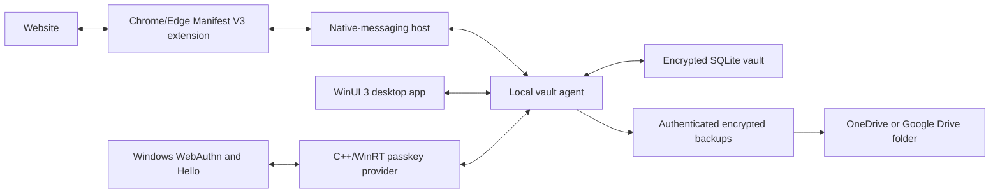

# Architecture

**Status:** Proposed, version 0.1
**Decision scope:** Windows-only MVP
**Related product specification:** [[MVP]]

This note defines the recommended technical shape of Librarian. It is an architecture proposal, not a record of settled decisions. The linked architecture decision records must be reviewed and accepted before implementation choices are treated as final.

## Scope guardrail

The MVP is a Windows 11 product. Implementation, testing, packaging, continuous integration, and release acceptance cover only the Windows desktop app, the Windows passkey provider, and the Chrome/Edge extension.

Android, macOS, iPhone, and iPad are future products. Their platform constraints should influence durable vault formats and narrow interface boundaries, but the MVP must not create placeholder applications, mobile build pipelines, speculative adapters, or a cross-platform user-interface layer. Portability is a design constraint; it is not an additional MVP deliverable.

## Architectural goals

- Keep decrypted credentials and cryptographic keys out of browser processes.
- Give one trusted local process responsibility for vault state and secret-bearing operations.
- Use native Windows security and passkey surfaces rather than imitating them.
- Keep platform-specific code thin enough that the vault and protocol logic can later be reused.
- Make every trust boundary versioned, testable, and fail-closed.
- Package and update the Windows components as one coherent product.

## Non-goals for the MVP

- Shared user-interface code across desktop and mobile platforms.
- Android, Apple-platform, Linux, or non-Chromium deliverables.
- A live cloud service or multi-device synchronization protocol.
- An extension-only vault.
- A plugin framework or general-purpose secrets platform.

## Proposed system



The **local vault agent** is the trust center. It is the only long-lived process allowed to hold the unlocked vault key or read and write decrypted credential records. The desktop app, passkey provider, and browser integration are clients with narrowly scoped requests; none opens the vault database directly.

## Component responsibilities

| Component | Proposed technology | Responsibility |
|---|---|---|
| Vault agent and portable security core | Stable, repository-pinned Rust | Vault lifecycle, cryptographic operations, record validation, credential policy, backup creation, and authorization of client requests. |
| Windows desktop app | C++/WinRT, WinUI 3, current stable Windows App SDK | Setup, unlock, account management, backup and recovery UI, notifications, and native Windows lifecycle. |
| Windows passkey provider | Thin C++/WinRT component over the Windows WebAuthn plugin APIs | Translate Windows passkey requests into constrained agent operations and return signed responses. |
| Browser extension | TypeScript, Chromium Manifest V3 | Detect sign-in fields, match the exact origin, present the in-field menu, fill selected values, and capture save/update intent. |
| Native-messaging host | Small Rust executable | Validate and relay a bounded extension protocol to the agent. It contains no independent vault and no persistent plaintext cache. |
| Local storage | SQLite with vault-layer authenticated encryption | Provide transactional storage for encrypted records, schema versions, and recovery metadata. The exact schema and encryption construction require a separate decision. |
| Installer and updater | MSIX for Windows-native components | Install, register, update, and remove the app, agent, native host, and passkey provider coherently. |

## Repository shape

Use one modular monorepo so protocol definitions, security-critical changes, test vectors, packaging, and end-to-end tests can evolve in a single reviewed change.

```text
apps/
  windows/
  browser-extension/
crates/
  vault-core/
  vault-agent/
  vault-format/
platform/
  chromium-native-host/
  windows-passkey/
packaging/
  msix/
tests/
  e2e/
  test-vectors/
docs/
  adr/
```

The repository should not contain empty Android or Apple projects during the MVP. Those projects should be added only when their implementation is authorized and staffed. See [[ADRs/0001 Monorepo]].

## Trust boundaries and invariants

1. **Web content is untrusted.** A field value, DOM label, icon, or page claim never establishes account identity or origin authority.
2. **The extension is not an unlock surface.** It never receives the master password, recovery material, or vault key.
3. **The agent owns plaintext.** Clients receive only the minimum value required for an approved, time-bounded operation.
4. **Origins are exact and explicit.** Matching uses parsed, normalized origins; display names and substring matching are insufficient.
5. **All local messages are hostile input.** Protocol messages are versioned, length-bounded, schema-validated, and authorized per operation.
6. **Cancellation and lock win.** A vault lock, Windows cancellation, process restart, or protocol mismatch fails closed.
7. **Secrets are not telemetry.** Passwords, passkey private material, authentication secrets, recovery material, and decrypted records are never logged.
8. **Backup is part of the security model.** A backup is encrypted, authenticated, versioned, rotated safely, and restorable without the original device.

## Key and data model

The following is a design direction, not an approved cryptographic specification:

- Generate a random vault key rather than deriving the data-encryption key directly from the master password.
- Protect that vault key with separate wrappers for master-password unlock, local Windows Hello convenience unlock, and recovery.
- Encrypt and authenticate records with explicit format and key versions.
- Store portable passkey private material inside the encrypted vault so a validated backup can restore it.
- Treat Windows Hello as a device-local key-release mechanism, never as the only recovery mechanism.
- Minimize unencrypted metadata and document every field that remains visible while the vault is locked.

Algorithms, libraries, password-derivation parameters, nonce construction, key rotation, rollback detection, memory clearing, and recovery authorization remain unresolved. They require a threat model, an accepted cryptography ADR, deterministic test vectors, and independent review before real credentials are stored.

## Local protocols

Use two distinct, versioned protocols:

- **Extension protocol:** Chromium native messaging between the extension and the native host. Requests include the verified browser origin, operation type, and a short-lived correlation identifier. Responses disclose no more than the selected operation requires.
- **Trusted local protocol:** authenticated local IPC between the native clients and vault agent. The exact Windows transport, peer verification, process lifecycle, and authorization model remain an implementation decision.

Do not expose the agent as a general local API. Unknown message versions, clients, operations, or fields must be rejected.

## Build and release baseline

- Pin the Rust toolchain, Windows SDK, Windows App SDK, package manager lockfiles, and extension dependencies in the repository.
- Start from the newest stable releases verified at repository creation; do not adopt previews by default.
- Build and test Windows-native artifacts on Windows runners.
- Run Rust unit and property tests, protocol conformance tests, extension tests, and deterministic cryptographic test vectors on every relevant change.
- Produce one versioned MSIX release set and test install, upgrade, rollback behavior, repair, and uninstall.
- Require end-to-end acceptance in both Chrome and Edge on supported Windows 11 builds.

The initial implementation baseline is documented in [[ADRs/0004 Windows MVP Technology Baseline]].

## Recommended implementation order

1. Accept the component-boundary ADRs and complete a repository threat model.
2. Scaffold only the Windows MVP monorepo and pin its toolchains.
3. Implement vault creation, lock, master-password unlock, and one encrypted test record in the Rust core.
4. Add the vault agent and authenticated local protocol; verify crash, cancellation, and lock behavior.
5. Add the WinUI desktop shell and Windows Hello key release.
6. Add the native-messaging host and one exact-origin password fill in Chrome and Edge.
7. Replace the passkey spike's mock storage with vault-agent operations and complete passkey create, authenticate, and delete.
8. Close [[MVP#Slice 1 — Trusted local foundation|MVP Slice 1]] end to end before broadening account features.

## Decision gates before production credential use

- Accepted threat model and data-flow inventory.
- Accepted cryptography, key hierarchy, storage format, and recovery design.
- Accepted IPC authentication and authorization design.
- Deterministic interoperability and corruption test vectors.
- Verified packaging, signing, and update behavior.
- Focused independent security review of the agent, provider, extension boundary, backup, and dependencies.

## Later platform expansion

When the Windows MVP is proven, add native platform shells around the portable core:

- Android: Kotlin/Compose UI plus the Android Credential Manager provider APIs.
- macOS, iPhone, and iPad: Swift/SwiftUI UI plus Authentication Services credential-provider extensions.

The Rust core should expose a narrow C-compatible or generated binding surface rather than platform UI abstractions. UniFFI is a candidate for future Kotlin and Swift bindings, but its use is not decided; first validate its lifecycle, error, cancellation, and secret-memory behavior in a small spike. See [[ADRs/0002 Portable Rust Core and Native Platform Shells]].

## Proposed decisions

- [[ADRs/0001 Monorepo]]
- [[ADRs/0002 Portable Rust Core and Native Platform Shells]]
- [[ADRs/0003 Windows MVP Component Boundaries]]
- [[ADRs/0004 Windows MVP Technology Baseline]]
