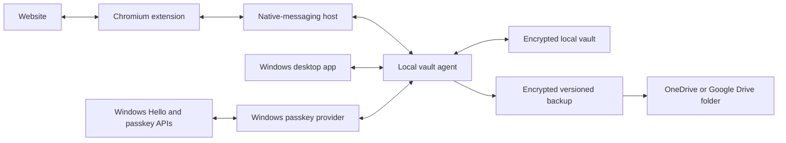

# MVP

**Status:** Product definition, version 0.3
**Target user:** One person
**Target system:** Windows 11
**Primary browsers:** Google Chrome and Microsoft Edge, with a Chromium-compatible extension

## Scope guardrail: Windows only

The MVP is intentionally limited to Windows 11. Its implementation, testing, packaging, continuous integration, support claims, and release acceptance cover the Windows desktop application, Windows passkey provider, and Chrome/Edge extension only.

Android, macOS, iPhone, iPad, Linux, non-Chromium browsers, and shared cross-platform UI are not MVP deliverables. Future-platform requirements may inform stable vault formats and narrow component interfaces, but they must not add placeholder applications, speculative build pipelines, or abstractions that delay the Windows MVP. Work on another platform begins only after all four Windows slices below pass their acceptance scenarios.

## MVP outcome

The MVP proves that one person can use Librarian as their everyday credential manager on a Windows 11 computer. They can create and use passkeys, generate and save passwords, fill credentials in Chromium browsers, store time-based authentication codes, and recover their encrypted vault after losing the computer.

Passkeys are the reason for building the product. They are a defining MVP capability, not a later enhancement. Password support provides migration and fallback for websites that are not ready for passkeys.

## Proven feasibility

The Windows passkey-provider feasibility spike passed on 2026-07-22. On Windows 11 build 26200.8875, the Microsoft Passkey Manager sample was retargeted to Windows SDK 10.0.28000.0, built, registered, and enabled. Using Google Chrome and webauthn.io, the test user created a passkey, authenticated with it, deleted it, and confirmed it was no longer offered.

This proves that Windows can route passkey creation and authentication through a third-party provider. The spike is disposable evidence, not production code: it uses Microsoft's mock credential storage and must never hold real credentials.

## Delivery sequence

The MVP should be built as four complete Windows vertical slices. Each slice must work end to end on the supported Windows 11, Chrome, and Edge baseline before the next begins.

### Slice 1 — Trusted local foundation

- Create an encrypted local vault.
- Unlock it with a master password and Windows Hello.
- Add, edit, view, and delete one website account in the desktop app.
- Connect a Chromium extension through an authenticated native channel.
- Fill a saved username and password for an exact matching origin.
- Create, authenticate with, and delete a passkey whose private material is owned by the same vault.

Slice 1 is complete only when the desktop app, extension, Windows passkey provider, and vault operate as one coherent system using disposable test credentials.

### Slice 2 — Everyday password experience

- Persistent in-field credential dropdown.
- Multiple-account selection.
- Opinionated password generation.
- Pending generated-password preservation.
- Manual credential capture.
- Password-update detection, confirmation, and history.
- Autofill-once behavior that respects user edits.

### Slice 3 — Authentication codes

- Manual entry of an authenticator setup key.
- Explicit QR-code capture after a user action.
- Code display, copy, and in-field fill.
- Correct account and origin association.

### Slice 4 — Backup and recovery

- Automatic encrypted, versioned backups to a user-selected OneDrive or Google Drive synchronized folder.
- A separately stored recovery kit.
- Backup validation without replacing the live vault.
- Full restore on a clean Windows profile, followed by fresh Windows Hello enrollment.

Import, family features, live cloud synchronization, and other platforms begin only after all four slices pass the acceptance scenarios below.

## Experience principles

1. **Secure by default.** The safest available sign-in method should also require the least thought.
2. **Passkey first, not passkey only.** Prefer passkeys while supporting the password-based web that exists today.
3. **One sign-in companion.** Passwords, passkeys, and time-based authentication codes live together so a user does not need several apps.
4. **Do not fight the user.** Automatic actions happen once; manual controls remain available.
5. **Native trust surfaces.** Master-password and Windows Hello prompts belong to the Windows application, never to a web-like extension overlay.
6. **Local and recoverable.** The live vault works offline and stays on the computer, but encrypted backups can restore it elsewhere.
7. **Progressive disclosure.** Common actions are prominent; technical metadata and uncommon settings stay out of the way.

## System boundary

The accepted Slice 1 component boundary is summarized below; [[Architecture]] contains the rationale, trust boundaries, repository shape, and implementation order. Product behavior in this specification remains normative. Cryptography, recovery authorization, exact IPC, signing, and production-security choices remain separately gated.

### Windows desktop app

The desktop app is the recognizable native setup, unlock, and account-management surface. It owns:

- Initial vault setup.
- Master-password unlock.
- Windows Hello convenience unlock.
- Account search, viewing, creation, editing, and deletion.
- User-facing passkey and authentication-code management.
- Locking, backup, and restore.

The initial screen is an unlock screen whenever the vault is locked. The information architecture after unlock remains a design task.

### Local vault agent

The local vault agent is the accepted trust center. It is the only long-lived process allowed to open the encrypted vault, hold the unlocked vault key, perform secret-bearing operations, and create backups. The desktop app, passkey provider, and browser integration make narrowly authorized requests rather than becoming independent vault implementations.

### Windows passkey provider

The passkey provider integrates with the Windows WebAuthn plugin APIs. It translates the transaction approved by Windows and the user into constrained vault-agent operations. It must not expose general record lookup or create a second credential store.

### Native-messaging host

The registered native host is a small boundary between Chromium native messaging and the vault agent. It validates and relays a versioned, bounded protocol. It does not hold an independent vault or persistent plaintext cache.

### Chromium extension

The browser extension understands the current website and owns:

- Origin-aware credential matching.
- Detection of username, password, and authentication-code fields.
- The persistent in-field credential dropdown.
- Password generation and website-form filling.
- New-account capture and password-update prompts.
- Authentication QR-code discovery and capture.
- Narrow requests to the native host through Chromium native messaging.

The extension must not:

- Ask for the master password.
- Become an independent copy of the full vault.
- Persist decrypted vault contents beyond what is required for an active operation.
- Trust a website-provided identity without validating its origin.

## Core credential model

The main user-visible object is an **account**, not a collection of cryptographic objects. An account may contain:

- Service or website name.
- One or more permitted website origins.
- Username, email address, or account label.
- Password and password history.
- One or more passkeys and the metadata required to use them safely.
- A time-based authentication secret and its display parameters.
- Recovery codes when the user chooses to store them.
- Minimal notes.

Technical passkey and authentication metadata should stay hidden during normal use.

## Required flows

### 1. Create and use a passkey

1. A website offers to create a passkey.
2. Windows presents Librarian as a passkey provider.
3. The user approves through Windows Hello.
4. The passkey is encrypted and stored in the local vault.
5. On a later visit, the user selects the account and approves through Windows Hello.
6. The website signs the user in without a password.

The desktop app must also let the user identify and remove stored passkeys.

### 2. Add an account manually

The desktop app lets the user add a website, username, and password. It should also offer a strong generated password without requiring the user to configure a generator first.

### 3. Fill a saved credential

- Automatic fill happens at most once per page or sign-in step.
- The credential dropdown remains available whenever the relevant field is focused.
- When multiple accounts match an origin, the dropdown lets the user choose the intended account.
- If the user deletes or changes an automatically filled value, the extension treats that as intentional and does not automatically refill it.
- The user can explicitly choose an entry from the persistent dropdown to fill it again at any time.
- Dynamic page updates, validation errors, and back navigation must not cause repeated automatic filling.

### 4. Generate and save a password for a new account

1. The password field offers **Create strong password** in the persistent dropdown.
2. One action fills the password and confirmation fields.
3. The manager immediately preserves a recoverable pending copy locally so navigation or a website error cannot lose it.
4. After successful registration, a small confirmation says that the account was saved and offers **Edit** and **Undo**.
5. Because the user explicitly chose a manager-generated password, the manager does not ask a redundant save question.
6. If registration fails, the pending password remains available but is not treated as a confirmed account.

### 5. Capture a manually entered password

After successful account creation with a user-entered password, show a non-blocking **Save this account?** prompt. The detected origin and username are already populated, and saving requires one action.

### 6. Update a password

- Preserve the previous and proposed passwords until success is established.
- Prompt **Update the password for this account?** after a successful change.
- Never silently overwrite a credential when several accounts match the website.
- Retain password history so an incorrect update can be recovered.

### 7. Add and use an authentication code

1. The extension automatically recognizes that a page appears to be setting up an authenticator.
2. It offers a one-click **Save authentication code** action.
3. After the user invokes the action, the extension temporarily reads the visible active tab and decodes the QR code locally.
4. It accepts only a valid authenticator setup payload and associates it with the current origin and account.
5. The secret is transferred to the native vault and removed from temporary extension memory.
6. The current code is immediately offered so the user can complete the website's verification step.
7. Manual entry of the website's setup key is always available as a fallback.

For later sign-ins, the current code appears in the persistent dropdown for the authentication-code field and can be filled explicitly. The desktop app can also display and copy the current code.

The extension must not silently save every QR code it sees. Automatically finding the setup opportunity is desirable; storing a new authentication secret requires one clear user action.

### 8. Unlock the vault

- A master password is the dependable vault-unlock method.
- Windows Hello is the normal convenience-unlock method after initial setup.
- Windows Hello releases locally protected key material; it is not a portable recovery mechanism.
- The extension asks the native app to unlock and never imitates an unlock form inside the webpage or extension overlay.
- Librarian locks after 15 minutes without Windows keyboard, mouse, or touch input.
  Windows sleep, session lock, and sign-out lock it immediately.

### 9. Back up and restore the vault

1. The user selects a local folder already synchronized by OneDrive or the Google Drive desktop client.
2. The app writes authenticated, encrypted, versioned backups to that folder automatically.
3. The cloud provider receives opaque encrypted files and cannot decrypt vault contents.
4. Initial setup produces high-entropy recovery material that the user is instructed to keep separately from the computer.
5. On a replacement Windows computer, the user installs Librarian, selects **Restore existing vault**, chooses the backup, and supplies the required recovery material.
6. Restore preserves passwords, passkeys, authentication secrets, metadata, and history.
7. Windows Hello is enrolled again on the replacement device.
8. A built-in validation operation confirms that a backup is readable without replacing the live vault.

The backup writer must use safe replacement and rotation so a failed write cannot destroy the only good backup.

## MVP acceptance scenarios

The MVP is complete only when all of these work end to end on a supported Windows 11 build:

- Create a new local vault, configure Windows Hello, lock it, and unlock it by both supported methods.
- Install the same extension package in Chrome and Edge and connect it to the native app.
- Create a passkey on a real test relying party, close the browser, return, and sign in with that passkey.
- Create a password-based account using a generated password and confirm it is preserved through successful and failed registration paths.
- Manually save an account and use it on a later browser session.
- Exercise a website with multiple saved accounts and select the correct one from the persistent dropdown.
- Edit an automatically filled field and verify that the extension does not fight the edit or automatically refill it.
- Change a password, recover the previous value from history, and then confirm the correct update.
- Capture a valid authenticator QR code, complete setup, and fill a later time-based code.
- Create an encrypted backup in a synced folder and restore the complete vault on a clean Windows profile.
- Verify that the browser extension never displays or receives the master password.

## Explicitly outside the MVP

- Import from 1Password and LastPass. This is the first fast-follow feature.
- Family membership, administration, sharing, and recovery by another person.
- Cloud synchronization of the live vault.
- macOS, iPhone, iPad, Android, Linux, non-Chromium browsers, and cross-platform UI work.
- An extension-only mode for public or employer-managed computers.
- Children and dependent-family-member policies.
- General document storage, payment cards, and identity-document management.
- A final commercial hosting and business model.

## Security release boundary

The MVP may be used for controlled testing, but it must not be represented as production-ready for other families until its threat model, cryptographic design, native messaging boundary, passkey implementation, backup recovery, dependency chain, and update mechanism receive dedicated security review.
