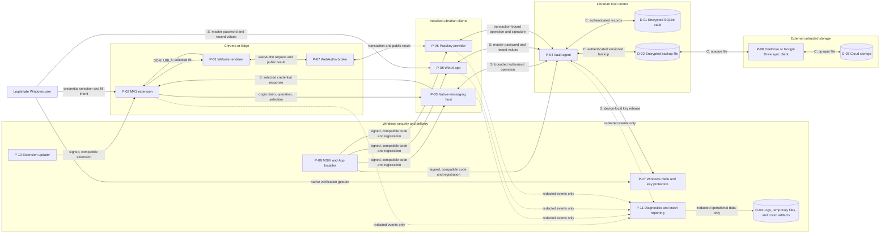
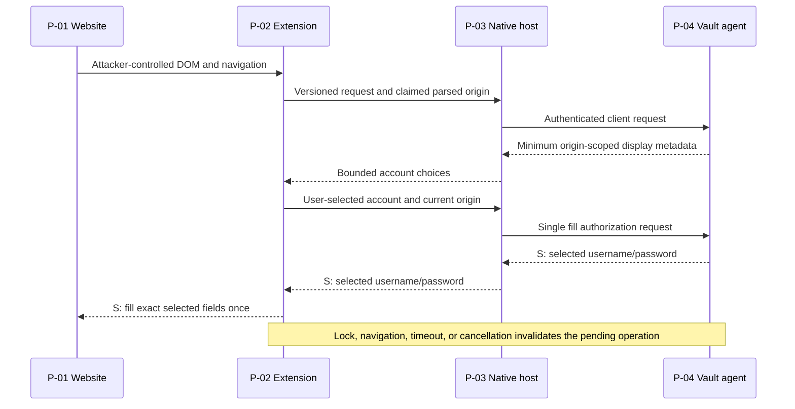
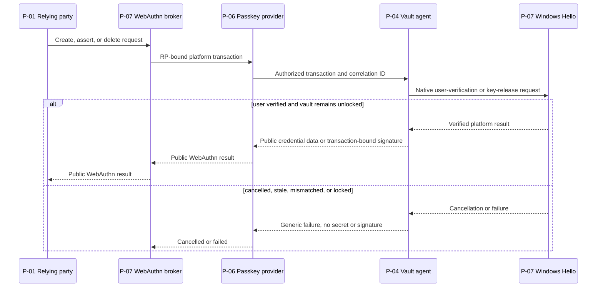

# Slice 1 Threat Model

**Status:** Reviewable security baseline, version 0.1
**Scope:** Windows-only Slice 1 trusted local foundation
**Related specifications:** [[MVP]], [[Architecture]]
**Decision issue:** [#8 — Create the Slice 1 threat model](https://github.com/theundeadmonk/Librarian/issues/8)
**Baseline revision:** `ff26bef`

## Overview

This document defines the security boundary that Slice 1 must preserve before Librarian implements credential storage, browser filling, Windows Hello unlock, or vault-backed passkeys. It turns the accepted architecture into testable security requirements; it does not select cryptographic algorithms, the local IPC transport, or release-signing infrastructure.

Librarian is a single-user Windows 11 credential manager with a WinUI desktop app, a local Rust vault agent, a Chromium extension and native-messaging host, and a Windows passkey provider. The vault agent is the trust center. It alone may keep an unlocked vault key or durable decrypted state. Every other component is a narrowly authorized client, even when it is installed as part of Librarian.

The repository is currently a fail-safe foundation. Credential storage, browser site access, native messaging, agent IPC, and passkey operations are disabled in code. This threat model defines the conditions under which later issues may enable those capabilities.

### Scope

The model covers:

- Vault creation, master-password unlock, Windows Hello convenience unlock, lock, and one website account.
- Exact-origin password selection and filling in Chrome and Edge.
- Passkey creation, assertion, and deletion through the Windows passkey-provider APIs.
- The WinUI app, browser extension, native host, vault agent, passkey provider, Windows security services, local files, installation and update mechanisms, logs, and crash behavior.
- Encrypted backup files as an adjacent security boundary because corruption and restore requirements constrain the Slice 1 vault format, even though full backup and recovery are delivered in Slice 4.
- Malicious websites, compromised extension contexts, stale or hostile clients, unprivileged local processes, and attacker-controlled or corrupted files.

The model does not approve a cryptographic construction, IPC transport, recovery policy, or signing service. Those remain blocking decisions in issues [#9](https://github.com/theundeadmonk/Librarian/issues/9), [#12](https://github.com/theundeadmonk/Librarian/issues/12), and [#19](https://github.com/theundeadmonk/Librarian/issues/19).

### Out of scope

- Family membership, sharing, organizer recovery, live cloud synchronization, and multi-user authorization.
- Authentication-code capture and filling, password-update heuristics, and importers, except where their future data must remain representable without weakening the Slice 1 vault boundary.
- Android, Apple platforms, Linux, non-Chromium browsers, and extension-only use.
- An attacker with Windows kernel control, administrator-equivalent debugging access to the running agent, or physical access to a running unlocked computer. These capabilities can defeat process isolation and are recorded as residual platform risk rather than treated as a boundary Librarian can reliably enforce.
- Compromise of Windows cryptographic primitives, Windows Hello, the WebAuthn broker, Chrome, Edge, or hardware-backed key protection themselves. Librarian must still validate their inputs, results, cancellation, and lifecycle.
- Availability of OneDrive, Google Drive, or their synchronization clients. Backup confidentiality, integrity, and safe restoration remain in scope; cloud availability does not.

### Protected assets and security objectives

| ID | Asset | Required properties |
|---|---|---|
| A-01 | Master password | Confidential during entry, IPC transfer, derivation, and disposal; never stored or logged. |
| A-02 | Vault key and derived encryption keys | Confidential, integrity-protected, purpose-separated, versioned, and retained in plaintext only by the unlocked agent. |
| A-03 | Windows Hello key wrapper or release material | Device-bound, user-verification gated, non-portable, and unusable as a recovery substitute. |
| A-04 | Recovery material | Confidential, portable, independently stored, and incapable of silently bypassing the approved recovery policy. |
| A-05 | Passwords and website account fields | Confidential except for the specific native view or exact-origin fill the user authorizes; integrity-protected at rest. |
| A-06 | Passkey private keys and credential metadata | Private keys never leave the agent; relying-party, user, algorithm, and credential metadata retain integrity and binding. |
| A-07 | Vault and backup ciphertext | Confidential, authenticated, versioned, corruption-detecting, rollback-aware, and safely replaceable. |
| A-08 | Authorization and lock state | Authentic, monotonic within a running session, race-resistant, and invalidated by lock, cancellation, restart, or client disconnect. |
| A-09 | Origin, relying-party, account, and transaction bindings | Canonical, explicit, non-ambiguous, and inseparable from the authorized operation. |
| A-10 | Client identity, protocol state, and release version | Authenticated where required, least-privileged, downgrade-resistant, and incompatible by default. |
| A-11 | Security-sensitive metadata | Minimized while locked; never sufficient to reconstruct secrets or enumerate unrelated accounts through an untrusted client. |
| A-12 | Logs, diagnostics, test fixtures, and crash artifacts | Useful for support without containing passwords, private keys, authentication secrets, recovery material, decrypted records, or raw IPC payloads. |

## Threat Model, Trust Boundaries, and Assumptions

### Actors and attacker capabilities

| Actor | Capabilities treated as in scope |
|---|---|
| Legitimate user | Creates and unlocks the vault, authorizes native operations, selects credentials, and may make mistakes. The design must make the safe action the simple default. |
| Malicious website | Controls its origin's HTML, JavaScript, frames, forms, labels, navigation, timing, and submitted values. It may imitate another service visually, create ambiguous forms, race navigation, or try to trigger operations without a clear user action. |
| Compromised extension context | Can send arbitrary extension-protocol messages, falsify page-derived claims, replay responses, inspect values disclosed to the extension, and attempt bulk enumeration. It does not automatically gain the vault key, master password, or direct database access. |
| Unprivileged local process | Can discover local endpoints, race startup, send malformed or replayed IPC, open files allowed by Windows ACLs, consume resources, and attempt to impersonate a Librarian client. Same-user arbitrary code execution is included for protocol abuse, although Windows may not prevent all same-user memory inspection or injection without additional hardening. |
| Other local Windows user | Can inspect globally accessible endpoints and files but must not cross per-user ACL, package-identity, or session boundaries. |
| Corrupted or hostile file source | Supplies truncated, reordered, oversized, replayed, downgraded, or intentionally malformed vault, backup, database, manifest, or migration input. |
| Stale or hostile client | Uses an old, future, modified, or partially updated protocol implementation and attempts unsupported operations or fields. |
| Dependency or release-chain attacker | Attempts to introduce a malicious dependency, unsigned component, extension update, downgrade, mixed-version installation, or tampered registration manifest. |
| Cloud or sync provider | Can observe file names, sizes, timestamps, and encrypted bytes; can delay, delete, duplicate, replay, or corrupt backup files. It must not learn plaintext or recovery material. |

Attacker-controlled inputs include web content, URLs, origins claimed by the extension, form and account fields, native-message bytes, local IPC frames, passkey transaction fields received through platform callbacks, vault and backup bytes, schema versions, file paths, update manifests, cancellation timing, process termination, and resource pressure.

User-controlled inputs include the master password, website account data, explicit selection and consent actions, backup location, and recovery material. Developer- or release-controlled inputs include source code, protocol schemas, dependency locks, package manifests, CI configuration, signing policy, and release metadata. None becomes trusted merely because it is expected to be well formed.

### Process and data-store inventory

| ID | Process or store | Trust and secret posture | Security owner |
|---|---|---|---|
| P-01 | Website renderer and page scripts | Untrusted. Receives only the credential intentionally filled for its exact origin. | Browser extension exact-origin policy |
| P-02 | Chromium extension content scripts, UI, and service worker | Exposed to browser and supply-chain compromise. Holds only request-scoped values and no persistent plaintext vault cache. | Browser extension |
| P-03 | Rust native-messaging host | Authenticates the configured extension, validates a bounded protocol, and relays only allowed operations. No independent vault or persistent plaintext cache. | Native host |
| P-04 | Rust vault agent and portable security core | Primary trust center and only long-lived owner of unlocked keys, decrypted records, storage writes, and operation authorization. | Vault agent |
| P-05 | WinUI desktop app | Recognizable native setup, unlock, and account UI. Handles master passwords and displayed records transiently but never owns the vault database or durable vault key. | Windows app |
| P-06 | C++/WinRT passkey provider | Thin transaction client. It must never receive or persist a passkey private key or request an arbitrary vault record. | Windows passkey provider |
| P-07 | Windows WebAuthn broker, Windows Hello, and key-protection services | Platform trust anchor for native user verification and passkey routing. Results, cancellation, and transaction fields are still validated. | Windows platform integration |
| P-08 | OneDrive or Google Drive desktop sync client | External local process that can read and replace files in the selected synchronized folder. It receives only opaque authenticated backups. | Backup integration |
| P-09 | MSIX/App Installer process | Privileged native code-delivery boundary. Must maintain signer, package identity, registration, version, ACL, and rollback policy. | Native packaging and release |
| P-10 | Chrome/Edge extension updater | Separate privileged browser code-delivery boundary. Must maintain the approved extension identity, publisher, version, and compatibility policy. | Extension packaging and release |
| P-11 | Windows eventing, diagnostics, and crash-reporting processes | Untrusted disclosure sink. Structured metadata only; secret values and raw payloads are prohibited. | Every emitting component |

| ID | Data store | Trust and secret posture | Security owner |
|---|---|---|---|
| D-01 | SQLite vault and local metadata files | Hostile input when opened. Contains authenticated ciphertext plus the minimum explicitly approved clear metadata. | Vault format and agent |
| D-02 | Backup file in a synchronized folder | Hostile storage boundary. Contains only authenticated, versioned ciphertext and intentionally approved clear framing. | Backup writer and restore validator |
| D-03 | OneDrive or Google Drive cloud storage | Untrusted remote storage that can observe metadata and delay, delete, duplicate, replay, or corrupt D-02. | Backup writer and restore validator |
| D-04 | Application logs, temporary files, diagnostics, and crash artifacts | Untrusted disclosure sink. Secret values and raw payloads are prohibited. | Every emitting component |

The `vault-core` and `vault-format` crates execute inside P-04 rather than forming separate process boundaries. SQLite access and backup writes also occur only through P-04.

### System data-flow diagram

`S:` marks a boundary that may carry plaintext or key material. `C:` marks authenticated ciphertext. Other edges carry attacker-controlled, public, or secret-derived transaction data and still require validation.

### Sensitive flows

| Flow | Description | Secret-bearing crossings | Required fail-closed behavior |
|---|---|---|---|
| F-01 Vault create and master-password unlock | P-05 collects the password in native UI and sends it over authenticated IPC to P-04, which derives or unwraps keys and opens D-01. | P-05 → P-04 carries A-01; P-04 holds A-02. | Authentication failure, malformed metadata, cancellation, timeout, or corruption leaves the agent locked and releases no partial record. |
| F-02 Windows Hello unlock | P-05 initiates a native flow; P-04 and P-07 perform user verification and release the device-local wrapper according to the design selected by #15. | P-07 ↔ P-04 may carry A-03 and unwrapped A-02 within the selected platform API. | Cancellation, missing enrollment, wrong user/session, stale completion, or agent restart leaves the vault locked. |
| F-03 Desktop account management | P-05 requests one record and submits validated changes to P-04. | P-04 ↔ P-05 carries only the selected A-05 fields. | Locked state, client loss, validation failure, or write failure discloses nothing and commits nothing. |
| F-04 Password selection and fill | P-02 derives browser context, P-03 validates the extension message, P-04 returns minimum display metadata and then the one selected credential. | P-04 → P-03 → P-02 carries bounded A-11 metadata; P-04 → P-03 → P-02 → P-01 carries one A-05 value for one authorized operation. | Origin ambiguity, background navigation, lock, timeout, mismatched selection, or protocol failure returns no secret. |
| F-05 Passkey create, assert, and delete | P-07 supplies a WebAuthn transaction through P-06. P-04 authorizes the operation and generates or uses A-06 without exporting the private key. | A-06 remains in P-04; only public credential material or a transaction-bound signature returns through P-06. | RP mismatch, unsupported algorithm, cancellation, replay, lock, stale transaction, or failed persistence returns no success result. |
| F-06 Vault and backup persistence | P-04 validates, encrypts, authenticates, versions, and transactionally writes D-01 or D-02; P-08 synchronizes D-02 to D-03. | Only C: authenticated ciphertext leaves P-04. | Parse or authentication failure, rollback, interrupted write, partial synchronization, or unsafe replacement never opens a partial vault or replaces the last known-good file. |
| F-07 Install and upgrade | P-09 installs and registers native components; P-10 independently installs P-02. Both must preserve one compatible product boundary. | No runtime secret should cross this flow; signing keys remain outside the repository and endpoints. | Unsigned, untrusted, downgraded, partially installed, or protocol-incompatible components cannot connect to an unlocked agent. |
| F-08 Diagnostics and crashes | Components emit structured operational events through P-11 into D-04 and may be terminated at any instruction boundary. | No secret-bearing crossing is permitted. | Crash, panic, exception, or dump collection locks on restart, invalidates pending operations, and never deliberately serializes raw secret state. |

### Password-fill sequence

The native host can authenticate the extension identity, but Chromium native messaging does not independently attest the active tab's web origin. The origin is therefore an extension-supplied claim. Exact parsing, least disclosure, explicit operation scoping, extension hardening, and signed update integrity reduce the risk but do not eliminate it if the authorized extension is fully compromised.

### Passkey sequence

### Trust-boundary ownership and planned negative tests

| Boundary | Owner | Required control | Planned negative test or blocking work |
|---|---|---|---|
| TB-01 User ↔ native trust surfaces | Windows app and Windows platform integration | The extension never asks for the master password or imitates Windows Hello; consent text binds the operation and target. | Attempt unlock from extension UI; cancel native prompts; background or obscure the requesting app. Validate in [#14](https://github.com/theundeadmonk/Librarian/issues/14), [#15](https://github.com/theundeadmonk/Librarian/issues/15), and #20. |
| TB-02 Website ↔ extension | Browser extension | Treat DOM and labels as hostile; parse and normalize the browser-provided origin; fill once; re-check navigation before disclosure. | Subdomain, suffix, IDN, non-default port, iframe, redirect, SPA navigation, and user-edit tests in [#17](https://github.com/theundeadmonk/Librarian/issues/17). |
| TB-03 Extension ↔ native host | Native host | Pin allowed extension identity, bound message length, validate schema and version, and expose no general vault API. | Wrong extension ID, malformed framing, oversized body, unknown field/version, replay, disconnect, and timeout tests in [#16](https://github.com/theundeadmonk/Librarian/issues/16). |
| TB-04 Native host ↔ vault agent | Vault agent and IPC layer | Authenticate the client, authorize only browser operations, bind connection/session/operation, and disclose one selected exact-origin record. | Same-user impersonation, token theft/replay, cross-client operation, stale connection, lock race, and agent restart tests in #12 and [#13](https://github.com/theundeadmonk/Librarian/issues/13). |
| TB-05 WinUI app ↔ vault agent | Vault agent and Windows app | Authenticate the native client; separate unlock, read, write, lock, and administrative capabilities; minimize secret lifetime in UI memory. | Modified client, unauthorized operation, invalid record, concurrent edit, failed write, cancellation, and post-lock response tests in #10, #12, and #14. |
| TB-06 Passkey provider ↔ vault agent | Vault agent and passkey provider | Authenticate provider identity; accept only transaction-scoped passkey operations; bind RP, account, credential, algorithm, user verification, and correlation state. | Wrong RP/credential, unsupported algorithm, replayed transaction, arbitrary-sign request, deletion race, lock, and provider crash tests in #12 and [#18](https://github.com/theundeadmonk/Librarian/issues/18). |
| TB-07 Agent ↔ Windows Hello and key protection | Vault agent and Windows platform integration | Use a system-owned prompt and device-bound wrapper; bind completion to the current unlock epoch; never treat cancellation as success. | No enrollment, cancellation at every stage, delayed callback after lock, wrong Windows session, wrapper corruption, and restart tests in #15. |
| TB-08 Agent ↔ vault files | Vault format and vault agent | Authenticate before interpretation, enforce format/resource limits, use transactional writes, and detect unsupported versions and rollback according to #9. | Bit flips, truncation, reordering, duplicate fields, oversized lengths, old version, rollback, interrupted write, and migration failure tests in #9 and [#10](https://github.com/theundeadmonk/Librarian/issues/10). |
| TB-09 Agent ↔ backup/sync/cloud | Backup writer and restore validator | Write only authenticated ciphertext; use safe rotation; validate into quarantine; never replace the live vault before complete verification. | Partial sync, stale generation, replay, rename race, cloud deletion, corrupt recovery metadata, wrong key, and clean-profile restore tests in #9 and #20. |
| TB-10 Release source ↔ installed components | Packaging and release | Verify trusted signers and identities; prevent downgrade; install compatible components and registrations atomically or leave them disconnected. | Unsigned/tampered package, wrong signer, mixed versions, stale extension, interrupted upgrade, repair, rollback, and uninstall tests in #19. |
| TB-11 Process ↔ diagnostics/crash artifacts | Every component | Redact by construction; never log raw requests, records, cryptographic buffers, or secrets; invalidate state after crashes. | Seed unique disposable canary secrets, exercise errors/crashes, and scan logs, event records, temp files, and configured dumps in #20. |

### Security invariants

1. **I-01 — The agent is the only long-lived plaintext owner.** Only P-04 may retain the unlocked vault key or durable decrypted record state. Other components receive the minimum request-scoped value and must not cache it persistently.
2. **I-02 — Unlock material never enters browser-facing components.** The master password, recovery material, vault key, and Windows Hello wrapper never enter P-01, P-02, P-03, or P-06.
3. **I-03 — Lock and cancellation win every race.** Lock increments or replaces the authorization epoch, cancels pending operations, clears agent-held secret state as far as the platform allows, and prevents late asynchronous completions from returning secrets or signatures.
4. **I-04 — Restart is locked.** Agent, client, provider, browser, Windows-session, or computer restart cannot restore an unlocked session or reusable authorization token.
5. **I-05 — Every local request is authenticated and authorized.** Connectivity, same-user identity, installation path, or possession of a message is not sufficient authorization. Each client type has a fixed operation allowlist.
6. **I-06 — Origin and RP bindings are exact.** URL origins use parsed scheme, canonical host, and effective port. Passkeys bind to the WebAuthn RP ID and current platform transaction. Display names, substring matching, page labels, and favicons grant no authority.
7. **I-07 — Secret disclosure is singular and intentional.** A browser flow returns at most the selected fields for one operation and origin. It cannot enumerate the vault, retrieve unrelated records, request keys, or perform arbitrary signing.
8. **I-08 — Private passkey material never leaves the agent.** P-06 receives only public creation data, transaction-bound signatures, status, and the minimum metadata needed by Windows.
9. **I-09 — Files are hostile until authenticated.** Vault and backup data are bounded and authenticated before semantic interpretation; unsupported versions, corruption, rollback, and migration failures never yield partial plaintext.
10. **I-10 — Protocol incompatibility fails closed.** Unknown clients, versions, operations, required fields, capabilities, or mixed component releases receive a non-secret error and cannot connect to an unlocked agent.
11. **I-11 — Secrets are not diagnostics.** No password, key, private credential material, recovery value, decrypted record, raw IPC payload, or secret-bearing exception string is intentionally written to logs, telemetry, crash annotations, command lines, environment variables, or temporary files.
12. **I-12 — Installation preserves identity and compatibility.** Unsigned, incorrectly signed, downgraded, relocated, or partially installed components cannot acquire client authority.
13. **I-13 — Recovery does not create an alternate weak unlock.** Windows Hello is convenience only; recovery follows the separately approved portable policy and cannot silently weaken master-password or vault-key protection.
14. **I-14 — No production credential use before release gates.** Code and tests use disposable fixtures until every gate named below passes and `SECURITY.md` is deliberately updated.

### Security assumptions

- Supported Windows 11 security boundaries, per-user isolation, Windows Hello, WebAuthn, DPAPI/CNG or the later selected key-protection API, MSIX signature validation, Chrome, and Edge behave according to their supported contracts.
- The user installs Librarian through an approved signed channel and keeps Windows and the supported browser within the eventual security-support window.
- The user can recognize a Windows-owned Hello prompt and the native Librarian app, but is not expected to understand origins, keys, protocols, or cryptographic choices.
- The agent can obtain a verifiable client identity or a defensible authorization mechanism from the transport selected by #12. If Windows cannot provide the required property, the architecture must be revised rather than treating a weak signal as authentication.
- The cryptography decision in #9 will use reviewed libraries and constructions, explicit domain separation, deterministic test vectors, and parameters calibrated on supported Windows hardware.
- A filled password becomes available to scripts executing with authority at the exact destination origin. Librarian cannot keep a password confidential from the site to which the user intentionally submits it.

### Residual risks

- A fully compromised authorized extension can falsify its active-origin claim. Native messaging authenticates the extension, not the web page. Least disclosure and exact matching limit accidental and bulk exposure, while signed updates and narrow permissions reduce compromise likelihood, but independent active-tab attestation is not available through the accepted channel.
- Same-user arbitrary code execution may permit memory inspection, injection, accessibility capture, clipboard monitoring, or theft after a legitimate disclosure. IPC authentication prevents an accidental general API; it does not claim to defeat administrator-equivalent or full-session malware.
- Plaintext necessarily exists in agent memory and transiently in the native UI, extension, and destination page for approved operations. Memory clearing is best effort on managed operating-system memory with pagefile, hibernation, and crash-dump behavior.
- An attacker with a vault or backup can attempt offline master-password guessing. A calibrated memory-hard derivation raises cost but cannot compensate for a weak master password.
- File names, sizes, timestamps, backup cadence, and coarse account counts may remain visible to the local filesystem or sync provider. #9 must enumerate and justify every cleartext field.
- Denial of service, cloud deletion, browser-store outage, and malicious deletion by code already executing as the user cannot always be prevented. Safe rotation and retained known-good backups reduce recoverability impact.
- A malicious website at the correct origin can read or submit a password filled into its page. Passkeys reduce this exposure because the private key never leaves the agent and the signature is RP-bound.
- The Windows platform and browser supply chains are trusted dependencies. Librarian can pin its own dependencies and verify its own releases but cannot independently secure a compromised OS or supported browser.

## Attack Surface, Mitigations, and Attacker Stories

### Entry points

| ID | Entry point | Untrusted input |
|---|---|---|
| E-01 | Extension content scripts and form detection | DOM trees, frames, fields, URLs, navigation, page messages, icons, and labels. |
| E-02 | Chromium native-messaging stdin/stdout | Message length prefix, JSON or later schema bytes, operation, claimed origin, record selector, correlation state, and timing. |
| E-03 | Vault-agent local IPC | Connection identity, framing, protocol version, operation, capability, fields, concurrency, replay, cancellation, and disconnect timing. |
| E-04 | WinUI input and display | Master password, account fields, URLs, names, notes, user actions, window lifecycle, and accessibility surfaces. |
| E-05 | Windows passkey-provider callbacks | RP ID, user and credential entities, algorithms, client-data hash, options, cancellation, and transaction lifecycle. |
| E-06 | Windows Hello and key-protection callbacks | Enrollment state, user-verification result, key-wrapper status, cancellation, delayed completion, and session changes. |
| E-07 | Vault, SQLite, backup, migration, and recovery files | Bytes, versions, nonces, ciphertext, lengths, indexes, paths, filesystem metadata, generations, and partial writes. |
| E-08 | Installation, registration, and update data | Package identity, signer, version, manifest, native-host registration, extension ID, paths, ACLs, and downgrade state. |
| E-09 | Dependency, build, and release inputs | Source changes, lockfiles, generated bindings, CI actions, fetched SDKs, packages, artifacts, and signing configuration. |
| E-10 | Errors, logging, metrics, crash handling, and cleanup | Exception text, formatting arguments, raw buffers, file paths, environment, process state, dump policy, and shutdown timing. |

### Threat and mitigation register

| ID | Attacker story and impact | Required mitigation | Validation or blocker |
|---|---|---|---|
| T-01 | A malicious site imitates another service or uses a look-alike subdomain, IDN, port, iframe, or redirect to receive the wrong password. | Canonical origin parsing, exact scheme/host/effective-port match, browser-derived context, navigation re-check immediately before disclosure, and explicit selection for ambiguity. | #17 origin corpus and real Chrome/Edge tests; I-06. |
| T-02 | A same-origin script reads a password after an authorized fill or changes the form destination. | Treat disclosure to the exact origin as intentional, fill only selected fields once, suppress automatic refill after edits/navigation, and prefer passkeys when available. Never claim filled passwords are hidden from the destination site. | #17 hostile DOM and navigation tests; residual risk documented. |
| T-03 | A compromised extension requests or exfiltrates many unrelated records. | No vault enumeration or general search API; return bounded non-secret choices, then one selected credential for one origin and operation; no persistent plaintext cache; pinned extension identity; reviewed permissions and signed updates. | #12, #16, #17, and #19. Independent origin attestation remains a residual risk. |
| T-04 | A hostile extension or local process exploits message parsing or resource use. | Length-prefix limits before allocation, strict schema with rejected unknowns where compatibility requires it, bounded collections and strings, deadlines, cancellation, rate/resource limits, and memory-safe parsing in the Rust host and agent. | Fuzz/property tests and oversized/malformed corpus in #12, #13, and #16. |
| T-05 | An unprivileged process impersonates the desktop, host, or provider or replays a captured authorization. | Transport-level peer verification, per-client operation allowlists, connection-bound short-lived authorization, replay resistance, per-user/session ACLs, and no bearer secrets in files, command lines, or environment variables. | #12 must demonstrate same-user and cross-user negative tests before #13 enables IPC; I-05. |
| T-06 | Lock, cancellation, disconnect, or process crash races with an asynchronous secret or signature response. | Monotonic unlock epoch, request state bound to epoch/client/transaction, cancellation propagation, response check at commit and disclosure, zero success on ambiguous completion, and locked restart. | Race tests at every boundary in #10, #13, #15, #17, #18, and #20; I-03 and I-04. |
| T-07 | A stale, future, modified, or partially updated client exploits protocol confusion or fallback. | Explicit handshake and capability negotiation, reject unknown required semantics, no silent downgrade, minimum compatible version policy, and disconnect all clients across upgrade. | Version matrix and mixed-install tests in #12, #16, and #19; I-10 and I-12. |
| T-08 | A corrupted vault or backup triggers parser memory exhaustion, unsafe migration, partial decryption, or integrity bypass. | Authenticate and bound the outer format before deep parsing, use vetted libraries, canonical encodings, checked arithmetic, transactional migrations, and quarantine invalid input. | Deterministic corruption and fuzz vectors in #9 and #10; clean-profile restore in #20; I-09. |
| T-09 | A valid older vault or backup is replayed to restore deleted credentials, old passkeys, or weaker metadata. | Authenticated format generation, documented rollback-detection strategy, safe known-good rotation, explicit user-visible recovery choice when freshness cannot be proven, and no silent downgrade. | #9 design and rollback vectors; backup restore scenario in #20. |
| T-10 | A stolen ciphertext is attacked offline through the master-password wrapper. | Random vault key, independently versioned wrapper, calibrated memory-hard password derivation with unique salt and explicit parameters, password guidance, and migration without exposing plaintext. | Cryptography ADR, benchmarks, and vectors in #9. Weak user-chosen passwords remain residual risk. |
| T-11 | Windows Hello cancellation, stale completion, or wrong-session state releases the vault key. | Device-bound key wrapper, system-owned verification UI, current-user/session binding, unlock-epoch check after callback, non-exportability where supported, and no success fallback. | #15 cancellation matrix, delayed callback, sign-out, enrollment loss, and wrapper-corruption tests; I-03 and I-13. |
| T-12 | A modified provider asks the agent to sign arbitrary data or substitutes the RP, user, credential, or algorithm. | Authenticate provider client, validate supported algorithms and complete transaction binding, allow only create/assert/delete verbs, perform private-key operation inside the agent, and return no raw signing primitive. | #12 and #18 RP mismatch, arbitrary-sign, replay, unsupported-algorithm, and deletion tests; I-08. |
| T-13 | A crash or error writes a password, key, raw request, decrypted record, or recovery value to a log, temporary file, event, or dump. | Typed redacted events, allowlisted fields, secret-wrapper types with safe formatting, no raw payload logging, reviewed error chains, minimized dump collection, cleanup on startup, and canary-secret scanning. | Repository-wide logging tests and Windows crash exercises in #20; I-11. |
| T-14 | A malicious or compromised update installs code that can connect to the unlocked agent, or a partial update creates an unsafe compatibility fallback. | Signed artifacts from approved identities, pinned dependency and CI action inputs, protected release process, atomic compatible installation, extension-ID pinning, downgrade policy, and locked agent during repair/update. | #19 install, upgrade, repair, rollback, wrong-signer, and mixed-version tests; dependency review in every release. |
| T-15 | Cloud or sync storage reads, modifies, duplicates, delays, truncates, or deletes backup files. | Treat provider as opaque hostile storage; authenticated encryption; no recovery key beside the backup; safe rotation; validate fully into quarantine; preserve the live vault and last known-good backup. | #9 backup-format constraints and #20 corruption, partial-sync, wrong-key, stale-file, and clean-restore tests. |
| T-16 | A local process replaces a file or redirects a write through a path, link, ACL, or race. | Per-user protected storage, restrictive ACLs, handle-based validation where needed, safe create/replace semantics, reparse-point policy, no executable content from vault paths, and post-write authentication. | #9 filesystem semantics, #10 vault tests, and #19 install-path/ACL tests. |
| T-17 | A client causes denial of service through request floods, oversized records, expensive password derivations, repeated Hello prompts, or concurrent transactions. | Hard size/concurrency/deadline limits, serialized security transitions, prompt rate limiting, cancellation, backpressure, and bounded KDF scheduling without weakening parameters. | Load and abuse tests in #10, #12, #13, #15, #16, and #20. Availability impact is lower severity unless it causes data loss or unsafe fallback. |
| T-18 | An error-recovery path fails open, commits partial state, uses an older key/version, or returns success without durable storage. | Transactional state machine, explicit terminal states, authenticate-before-use, durable commit before success, no best-effort insecure fallback, and generic non-secret errors to untrusted clients. | Fault injection for disk-full, crash, cancellation, migration, lock, and update paths in #9, #10, #13, #18, #19, and #20. |

### Validation strategy

The accepted architecture invariants map to this model as follows:

| Architecture invariant | Threat-model enforcement | Primary validation |
|---|---|---|
| Web content is untrusted | I-06, T-01, T-02, TB-02 | Exact-origin, iframe, navigation, and hostile-DOM tests in #17. |
| The extension is not an unlock surface | I-02, TB-01, T-03 | Native-only unlock and simulated-extension-prompt tests in #14 through #16. |
| The agent owns plaintext | I-01, I-07, I-08 | Process-boundary, cache, and private-key non-disclosure tests in #10, #13, #16, and #18. |
| Origins are exact and explicit | I-06, T-01 | Canonical origin corpus and Chrome/Edge integration tests in #17. |
| All local messages are hostile input | I-05, I-10, T-04, T-05, T-07 | Hostile-client, malformed-frame, replay, version, and fuzz tests in #12, #13, and #16. |
| Cancellation and lock win | I-03, I-04, T-06 | Boundary race and delayed-completion tests in #10, #13, #15, #17, #18, and #20. |
| Secrets are not telemetry | I-11, T-13, TB-11 | Canary-secret scanning across diagnostics and crash paths in #20. |
| Backup is part of the security model | I-09, I-13, T-08, T-09, T-15 | Corruption, rollback, rotation, wrong-key, and clean-profile restore tests in #9 and #20. |

The Slice 1 acceptance path is covered end to end:

| MVP acceptance step | Covered by | Blocking implementation |
|---|---|---|
| Install on a clean Windows profile | F-07, TB-10, T-14 | #19 |
| Create a vault and unlock with the master password | F-01, TB-05, TB-08, T-06, T-08, T-10 | #9, #10, #12 |
| Enroll, lock, and unlock with Windows Hello | F-02, TB-07, T-11 | #12, #15 |
| Add, view, edit, and delete one account | F-03, TB-05, TB-08, T-06, T-18 | #10, #11, #12, #14 |
| Connect the same extension in Chrome and Edge | TB-03, TB-04, T-03 through T-07 | #12, #13, #16 |
| Fill only the exact matching origin and respect user edits | F-04, TB-02 through TB-04, T-01 through T-03 | #16, #17 |
| Create, authenticate, restart, and delete a vault-backed passkey | F-05, TB-06, TB-07, T-06, T-11, T-12 | #12, #13, #15, #18 |
| Exercise locked, cancelled, stale, restarted, and malformed states | I-03, I-04, I-09, I-10, T-04, T-06 through T-09, T-18 | #10, #13, #15 through #20 |
| Confirm the extension never receives the master password | I-02, TB-01, T-03 | #14, #16, #20 |
| Capture sanitized acceptance evidence | I-11, TB-11, T-13 | #20 |

Every implementation issue that crosses a boundary above must:

1. Reference the relevant TB, invariant, and threat IDs in its design or pull request.
2. Add deterministic negative tests before enabling the corresponding secret-bearing path.
3. Use disposable, uniquely identifiable canary credentials and local test relying parties where secrets are required.
4. Demonstrate that lock, cancellation, timeout, disconnect, crash, restart, and protocol mismatch produce no secret-bearing response and no partial durable success.
5. Exercise both Chrome and Edge where the browser boundary differs.
6. Inspect logs, diagnostics, temporary files, and configured crash artifacts for canary material.
7. Keep the fail-safe scaffold state when a blocking design is not yet accepted.

The end-to-end suite in #20 must trace the Slice 1 acceptance path across F-01 through F-05 and inject faults at TB-02 through TB-11. Tests must not require real credentials, production services, or external authentication accounts.

### Release gates before real credential use

Real passwords, passkeys, authentication secrets, recovery codes, and recovery material remain prohibited until all of the following are complete:

| Gate | Required evidence |
|---|---|
| G-01 Threat model | This document is accepted through #8 and all critical assumptions have an owner. |
| G-02 Cryptography and storage | #9 approves the key hierarchy, algorithms, libraries, record and backup format, metadata, migrations, corruption behavior, rollback policy, recovery relationship, and deterministic vectors. |
| G-03 Local authorization | #12 approves and tests the transport, peer identity, per-client authorization, framing, versioning, lifecycle, replay resistance, and incompatible-state behavior. |
| G-04 Secret-bearing implementations | #10 through #18 preserve the mapped invariants and pass their boundary-specific negative tests. |
| G-05 Packaging and updates | #19 verifies signing, identity, registration, permissions, install, upgrade, repair, rollback, mixed-version behavior, and removal. |
| G-06 End-to-end acceptance | #20 passes the full disposable-credential path in supported Windows 11, Chrome, and Edge environments, including fault injection and secret-leak checks. |
| G-07 Independent review | A focused security review covers the agent, cryptography, vault and backup parser, IPC, extension and origin boundary, Hello release, passkey transactions, packaging, dependencies, and residual risks. |
| G-08 Release policy | `SECURITY.md` is deliberately updated to name the supported release, platforms, reporting process, and remaining limitations. |

Passing a unit test or one gate does not authorize real credential use. A later architecture or security change can reopen a gate.

## Severity Calibration

Severity reflects the realistic impact within Librarian's single-user Windows MVP and the privileges an attacker needs.

### Critical

A critical issue enables broad or durable compromise of vault confidentiality or signing authority without already requiring administrator/kernel control.

Examples:

- Remote web content or an unprivileged local process can retrieve the vault key, master password, recovery material, all credentials, or arbitrary passkey signatures.
- Vault or backup authentication can be bypassed so attacker-chosen ciphertext becomes accepted plaintext or executable security state.
- The release path accepts an untrusted signer and installs code that can access unlocked vault operations at scale.
- A recovery mechanism silently grants vault access without the required user secret or approved authorization.

### High

A high issue compromises one or more credentials, bypasses a major authorization boundary, or causes security-relevant data loss under practical conditions, but has narrower scope or stronger prerequisites than critical.

Examples:

- Exact-origin failure fills a password into a different attacker-controlled origin.
- A same-user unprivileged process impersonates the passkey provider or desktop client and obtains one credential or valid signature.
- Cancellation or lock races return a secret after the user has denied or terminated the operation.
- A malicious valid-old backup silently rolls the vault back and restores revoked passkeys or deleted credentials.

### Medium

A medium issue exposes limited non-secret metadata, creates a bounded denial of service, weakens defense in depth, or requires substantial local access and user interaction without crossing the primary vault boundary.

Examples:

- An attacker can enumerate account display names for one exact origin but cannot retrieve secrets or query other origins.
- Malformed messages repeatedly crash the locked agent without corrupting storage or producing a secret-bearing artifact.
- A diagnostic event reveals vault location, component versions, or record counts but no secret fields.
- A same-user process can trigger excessive native prompts, with enforced rate limits preventing an authorization bypass.

### Low

A low issue has minor confidentiality or robustness impact, requires unrealistic conditions, or affects developer-only scaffolding without a path to a supported secret-bearing build.

Examples:

- A locked foundation build reveals a non-sensitive internal component name.
- Invalid disposable test data produces an unclear error but does not alter security state.
- A documentation mismatch has no effect on implementation, tests, release gates, or user trust decisions.

### Usually out of scope for a Librarian finding

- Reading agent memory after gaining kernel, administrator-equivalent debug, or full-session malware control, unless Librarian unnecessarily lowers the required privilege or persists the secret.
- Reading a password from a page at the exact origin after the user intentionally filled it; the relevant finding would instead be an origin-binding or unexpected-disclosure failure.
- Cloud-provider inability to synchronize or retain an opaque backup, unless Librarian destroys the local or last known-good copy or falsely reports a verified backup.
- Issues confined to ignored build output, disposable upstream samples outside this repository, or test-only fixtures with no path into shipped artifacts.

## Maintenance

Review and update this threat model whenever Librarian adds a process, client type, secret class, protocol operation, recovery path, backup format, update channel, supported browser, supported operating system, or family/multi-user capability. Cryptographic and IPC ADRs may add stricter requirements but must not weaken these invariants without explicitly amending this model and re-running affected negative tests.

Repository: https://github.com/theundeadmonk/Librarian
Version: ff26bef39eab073fe3bb804d7390c56d2305bef0
