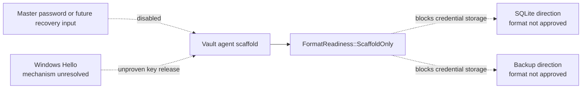
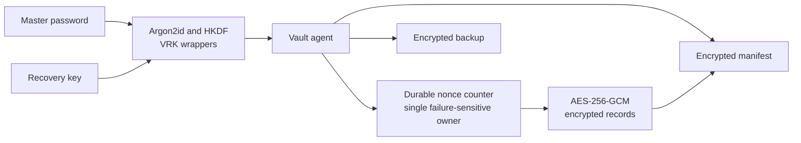
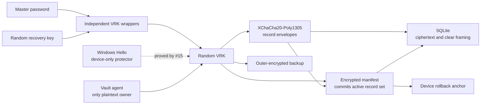
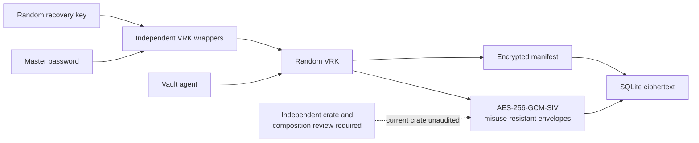

# Security Hardening Proposal: Establish One Versioned Vault Cryptographic Boundary

## Decision

Select the cryptographic ownership, nonce strategy, key hierarchy, database
integrity mechanism, backup boundary, migration posture, and review gate for
Librarian's first credential-bearing format.

## Executive Recommendation

The complete option set is:

- **Option 1 — AES-256-GCM with durable nonce counters:** use an audited,
  standardized AEAD and make a crash-safe counter allocator part of every
  encryption path.
- **Option 2 — XChaCha20-Poly1305 envelopes and an encrypted manifest:** use
  fresh random 192-bit nonces, purpose-derived keys, per-record envelopes, and
  a manifest that commits to the active record set.
- **Option 3 — AES-256-GCM-SIV envelopes:** keep Option 2's hierarchy and
  storage structure but choose a nonce-misuse-resistant standardized AEAD whose
  current stable Rust implementation has not received its own security audit.

I recommend Option 2 for the Windows MVP. The deciding constraint is not raw
cipher throughput; credential records are small. It is whether the nonce and
crash model remains easy to reason about after process termination, WAL
recovery, migration, and backup rotation. Random 192-bit nonces remove the
global counter's catastrophic failure mode while the audited Rust
implementation and libsodium oracle give us two useful validation paths.

This recommendation is conditional. The Windows Hello device protector,
rollback anchor, Argon2 latency, full-vault verification cost, strict parser,
and complete key schedule must pass the ADR's validation and independent
review gate before credential storage can be enabled.

## Evidence

I inspected the five repository artifacts at revision
`6416e0bfb72f3d02c2676ba09483eff1822fa087` and the current primary standards
and library documents listed below. The source shows an intentionally disabled
format rather than a vulnerable production implementation. The opportunity is
therefore preventive: make the high-impact invariants owned and testable before
the first secret enters the repository.

| Evidence | Finding or document | What it establishes |
|---|---|---|
| `E-01` | [Slice 1 threat model](../../../../Threat%20Model.md) | The agent owns plaintext; files are hostile; recovery, rollback, offline password attack, Hello release, and diagnostics are explicit threats. |
| `E-02` | [Windows MVP architecture](../../../../Architecture.md) | SQLite must sit below vault-layer authenticated encryption, with exact cryptography blocked on issue #9. |
| `E-03` | [Windows component-boundary ADR](../../../../ADRs/0003%20Windows%20MVP%20Component%20Boundaries.md) | Clients cannot write ciphertext directly or become independent vault implementations. |
| `E-04` | [Vault-format readiness guard](../../../../crates/vault-format/src/lib.rs) | No credential schema or cryptographic construction is approved. |
| `E-05` | [Vault-core readiness guard](../../../../crates/vault-core/src/lib.rs) | Credential storage is disabled while the format is scaffold-only. |
| `E-06` | RFC 9106, Argon2 | Establishes Argon2id version 19, recommended parameters, and vectors. |
| `E-07` | RFC 5869, HKDF | Establishes extract/expand and purpose binding through `info`. |
| `E-08` | RFC 8439, ChaCha20-Poly1305 | Establishes the standardized base AEAD and primitive vectors. |
| `E-09` | RFC 8452, AES-GCM-SIV | Establishes a misuse-resistant standardized alternative and its vectors. |
| `E-10` | RFC 8949, deterministic CBOR | Establishes the canonical serialization properties needed for stable AAD and vectors. |
| `E-11` | Microsoft Windows Hello guidance | Establishes platform user-verification flow but does not, in the reviewed material, prove Librarian's complete symmetric wrapper boundary. |
| `E-12` | RustCrypto `chacha20poly1305` 0.11.0 | Publishes an NCC Group audit statement and provides XChaCha20-Poly1305. |
| `E-13` | RustCrypto `aes-gcm-siv` 0.11.1 | Explicitly states that the crate itself has never had a security audit. |
| `E-14` | libsodium XChaCha20-Poly1305 guidance | Recommends the construction when interoperability is not required and supports random 192-bit nonces and independent verification. |

The **observed** facts are that the format is disabled, the threat model
requires one agent-owned boundary, and the candidate libraries publish
different audit postures. The **inferred** structural risk is that a format
which relies on dispersed nonce, wrapper, row-integrity, or migration
conventions would make those properties easy to violate as features arrive.
The design below is **proposed** behavior and must not be reported as
implemented.

## Current Design And Failure Mode

The current design is a safe scaffold: `vault-format` has one
`ScaffoldOnly` state, and `vault-core` returns false for credential-storage
approval. That is the right failure mode today. What is missing is a single
specification that future code can implement without deciding key
relationships or file semantics inside individual pull requests.

Without that specification, four controls can drift independently:

- a desktop unlock path could derive a data key directly from a password while
  a recovery path wraps a different root;
- record writers, migrations, and backups could allocate nonces differently;
- SQLite transactions could authenticate individual rows without detecting a
  deleted or replayed row set; and
- Windows Hello convenience unlock could quietly become a portable or weaker
  recovery mechanism.

The threat is structural because every later feature would have a plausible
reason to touch one of these controls. Centralizing them in the agent is
necessary but not sufficient; the on-disk bytes, labels, failure states, and
review gate also need one owner.

## Desired Invariants

- One random VRK is the portable root; passwords, recovery material, and Hello
  are independent protectors of that root rather than competing data keys.
- The master password and recovery key each restore a backup alone; Hello
  cannot.
- Every derived key has one versioned purpose label and cannot be substituted
  for another purpose.
- Every AEAD invocation gets a unique nonce under its key without depending on
  timestamps or process-local counters.
- The active record set is authenticated, not only each row in isolation.
- Unknown versions, malformed metadata, corruption, rollback, and migration
  failure yield no partial unlock or plaintext.
- Cloud storage receives one opaque authenticated backup payload.
- Locked metadata is enumerated and contains no user-authored account data.
- The code stays disabled until deterministic vectors, Windows proof, and
  independent review complete.

## Constraints And Non-Goals

The format must support the Windows 11 MVP but avoid Windows-only bytes inside
the portable vault. It must use current stable libraries, fixed resource
limits, and testable encodings. It does not design family sharing, multi-device
sync, remote freshness consensus, a human recovery-kit UI, or production
salvage. It does not claim protection from administrator-equivalent or kernel
attackers, and it cannot make best-effort memory zeroization absolute.

No latency or memory budget was supplied. We therefore use the RFC 9106
64 MiB Argon2id profile as an explicit baseline and require measurement rather
than claiming that it is fast. The same honesty applies to full-vault
verification and backup rotation.

## Before Architecture

The current boundary correctly blocks all secret-bearing persistence, but it
does not yet name the internal cryptographic owners:

Source: [comparable Mermaid file](../diagrams/vault-cryptographic-boundary-before.mmd).
The important edge is the readiness guard: it contains risk today, but it does
not yet tell implementation work what safe success looks like.

## Options

### Option 1: AES-256-GCM with durable nonce counters

The strongest case for this option is conventionality. AES-GCM is standardized,
widely accelerated on Windows hardware, and RustCrypto's stable crate publishes
a third-party audit with no significant findings. If external compliance or
interoperability required AES-GCM, we could build a sound system around it.

The cost is that nonce allocation becomes security-critical durable state. A
record write cannot merely ask the operating system for a nonce; it must reserve
a never-repeated value under the exact key, survive process termination at
every instruction, coordinate migrations and backups, and prevent restored
database snapshots from reusing a counter with a previously used key. We could
derive a unique key per record and epoch to narrow the allocator, but each
record still needs a durable update counter, and backup/manifest encryption
still needs equivalent treatment. Losing that invariant is catastrophic for
GCM rather than a recoverable data-format error.

The option would preserve record envelopes, the encrypted manifest, and the
same VRK hierarchy. It would add counter reservation to the transaction
protocol. The allocator would reserve a range in authenticated durable state
before use, never roll it back, and burn unused values after crashes. Migration
would assign a new epoch and key before restarting counters. Rollback would
restore the XChaCha design only through a full copy-on-write migration; we
cannot safely switch an existing GCM key back to earlier counter state.

Source: [Option 1 Mermaid file](../diagrams/vault-cryptographic-boundary-aes-gcm-after.mmd).

| Change | Before | After | Security consequence | Cost |
|---|---|---|---|---|
| Data root | No approved key | Random VRK with independent wrappers | Password changes do not re-encrypt records | Wrapper and recovery lifecycle |
| AEAD | None | AES-256-GCM | Audited implementation and standard primitive | Catastrophic nonce-reuse sensitivity |
| Nonces | None | Authenticated durable counters | Unique if allocator, epoch, migration, and rollback all work | New crash-critical state machine |
| Row integrity | None | Per-row AEAD plus encrypted manifest | Detects row substitution and deletion | Manifest rewrite per mutation |

This option likely has excellent throughput and small per-record nonce
overhead. Its memory profile is neutral. Reliability is where it pays: disk
full, WAL replay, backup restore, or a programming mistake can burn ranges or,
worse, reuse them. The operational burden is not a service, but it is a
permanent review burden on every migration and restore. I would choose it if a
hard AES-GCM requirement outweighed that lifecycle complexity.

### Option 2: XChaCha20-Poly1305 envelopes and an encrypted manifest

This option makes the common write path intentionally boring. The agent gets
24 random bytes from the Windows operating-system CSPRNG for every wrapper,
record, manifest, and backup encryption. At 192 bits, collision probability is
negligible for the product's bounded message count, so a process restart or
restored database does not resurrect a counter. Nonces still must never be
intentionally reused, and vectors must exercise their exact placement.

A random VRK remains stable across password change. Argon2id derives one
password key; HKDF binds that key to the vault and master-wrapper purpose. A
random recovery key independently derives a recovery wrapper. Both wrappers
protect the same VRK. From the VRK, HKDF derives record, manifest, and backup
keys under separate versioned labels. Windows Hello is allowed to protect or
release the VRK only after #15 proves a device-local, user-verification-gated
mechanism; the portable format stores no Hello material.

Each SQLite row contains a random record ID and a strict encrypted envelope.
The encrypted manifest lists every active record ID and the SHA-256 digest of
its complete envelope. A database attacker cannot delete, add, reorder,
substitute, or partially replay rows while keeping the current manifest valid.
A whole-file replay remains possible, so the agent records the highest
authenticated generation in a device-local anchor and states the remaining
clean-device limit explicitly.

Source: [Option 2 Mermaid file](../diagrams/vault-cryptographic-boundary-xchacha-envelopes-after.mmd).

| Change | Before | After | Security consequence | Cost |
|---|---|---|---|---|
| Data root | No approved key | Random VRK with master, recovery, and device-local protectors | Clear recovery semantics and cheap password change | Root-key lifecycle requires focused review |
| AEAD | None | XChaCha20-Poly1305 | Authenticated encryption with practical random-nonce safety | Not a final IETF RFC for XChaCha itself |
| Database | No format | Strict record envelopes plus encrypted manifest | Detects partial row manipulation and replay | Full manifest update and unlock verification |
| Backup | Direction only | Outer-encrypted authenticated SQLite image | Hides row-level metadata from cloud storage | Full-file encryption and rotation |
| Rollback | Undefined | Generation plus device-local last-seen anchor | Detects stale state previously seen on that device | Cannot prove freshness on a clean device |

The expected performance is more than adequate for small credential records,
but that is source-derived expectation, not measurement. The material latency
is Argon2id and the proposed full-record authentication pass at unlock. Memory
is bounded by one KDF workspace and one record buffer rather than the entire
vault. Reliability improves because nonce safety has no counter commit step;
the remaining durable sequence is the ordinary SQLite transaction plus anchor
update. Migration remains substantial but reversible: authenticate the old
vault, write and verify a new file with fresh nonces, then atomically swap while
retaining the old encrypted artifact.

What gives me pause is not the primitive's deployment history, which is broad,
but the distinction between standardized ChaCha20-Poly1305 and the XChaCha
extension. We compensate with exact bytes, libsodium differential checks, and
independent review. If those checks do not agree, this option does not ship.

### Option 3: AES-256-GCM-SIV envelopes

AES-GCM-SIV is the most attractive construction on paper for this storage
problem. It is standardized in RFC 8452 and degrades much more safely than GCM
if a nonce is accidentally reused. We could keep Option 2's random nonces,
envelopes, manifest, wrapper hierarchy, backup, and migration protocol while
gaining an additional defense against a class of nonce mistakes.

The concern is implementation evidence. The current stable RustCrypto
`aes-gcm-siv` crate says that it has never received a security audit, although
some underlying AES and POLYVAL dependencies were covered by another audit.
That is not proof of a flaw, and the RFC vectors plus an independent
implementation are useful. It does mean the first production vault would ask
our own review to cover more primitive implementation risk than Option 2.

GCM-SIV is a two-pass encryption construction. Credential records are small,
so the extra pass is unlikely to drive the product decision; backup encryption
could be more noticeable and must be benchmarked. Memory can remain bounded
with in-place APIs. Reliability and migration look like Option 2 because
random nonces still need no durable counter. Rollback would require a full
cipher-suite migration rather than swapping a dependency in place.

Source: [Option 3 Mermaid file](../diagrams/vault-cryptographic-boundary-gcm-siv-after.mmd).

| Change | Before | After | Security consequence | Cost |
|---|---|---|---|---|
| Key and storage structure | No approved format | Same hierarchy, envelopes, and manifest as Option 2 | Centralized, testable control ownership | Same implementation breadth as Option 2 |
| AEAD | None | AES-256-GCM-SIV | Misuse resistance if a nonce repeats | Current stable Rust crate is unaudited |
| Encryption path | None | Two-pass authenticated encryption | Stronger nonce-failure containment | Additional backup CPU pass |
| Migration | None | Versioned cipher-suite boundary | Future replacement remains possible | Full copy-on-write rewrite |

I would be comfortable preferring this option after an independent review of
the selected crate and Librarian composition, with an independent
interoperability implementation and acceptable backup benchmarks. Until then,
its theoretical misuse resistance does not outweigh the stronger current
implementation evidence for Option 2.

## Comparison

| Dimension | Option 1: AES-GCM counters | Option 2: XChaCha envelopes | Option 3: AES-GCM-SIV |
|---|---|---|---|
| Security | Standard audited AEAD; nonce allocator is catastrophic choke point | Large random nonce, audited Rust crate, manifest integrity; XChaCha extension not final RFC | Standard misuse-resistant AEAD; current stable Rust crate unaudited |
| Performance | Expected fastest on AES hardware; unmeasured | Expected ample for records; full unlock and backup unmeasured | Two-pass encryption; backup cost unmeasured |
| Memory | Small AEAD state plus Argon2 workspace | Small AEAD state, one record buffer, Argon2 workspace | Small AEAD state, one/two-pass buffers, Argon2 workspace |
| Reliability | Counter reservation couples encryption safety to durable state | Random nonces remove counter commit; ordinary transactional failure remains | Random nonces and misuse resistance simplify crash behavior |
| Operability | Permanent counter/epoch review burden | Dependency, vector, anchor, and corruption monitoring | Adds crate audit and implementation-review burden |
| Migration | Full rewrite to introduce or leave counter scheme | Copy-on-write version/suite migrations | Full rewrite on adoption or replacement |
| Reversibility | Difficult if counter history is uncertain | Retain old encrypted artifact and atomically swap | Same structural rollback as Option 2 |

The comparison is intentionally not scored. Option 1 wins on conventional
standardization and likely throughput but loses on lifecycle sharp edges.
Option 3 wins on nonce-misuse theory but currently loses on implementation
evidence. Option 2 has the most balanced failure model for a small local vault.

## Recommendation

I recommend Option 2 and the exact version 1 specification in
[ADR 0005](../../../../ADRs/0005%20Vault%20Key%20Hierarchy%20and%20Encrypted%20Record%20Format.md).
The recommendation changes if a required compliance profile mandates AES-GCM,
if current XChaCha implementation evidence degrades, or if AES-GCM-SIV receives
the missing independent review and passes our interoperability and backup
benchmarks.

Selection is not permission to store credentials. The readiness guard remains
until implementation, #15, vectors, fuzzing, measured thresholds, and the
named independent review all pass.

## Evidence Coverage And Residual Risk

| Evidence | Option 1 | Option 2 | Option 3 | Tactical work still required |
|---|---|---|---|---|
| `E-01 — Slice 1 threat model` | Mitigates key, file, and recovery threats; counter rollback remains sharp | Mitigates through one hierarchy, strict parser, manifest, backup, and anchor | Mitigates similarly to Option 2 | Negative races, corruption, rollback, and secret-canary tests |
| `E-02 — Windows MVP architecture` | Addresses agent-owned cryptography | Addresses agent-owned cryptography | Addresses agent-owned cryptography | IPC and client authorization remain in #12 |
| `E-03 — Component boundary ADR` | Addresses no-client-write invariant | Addresses no-client-write invariant | Addresses no-client-write invariant | Enforce crate/API visibility in implementation |
| `E-04 — Vault-format readiness guard` | Leaves disabled until implementation review | Leaves disabled until implementation review | Leaves disabled until implementation review | Change readiness only in the final gated PR |
| `E-05 — Vault-core readiness guard` | Leaves disabled until implementation review | Leaves disabled until implementation review | Leaves disabled until implementation review | Preserve negative test throughout migration |
| `E-06 to E-10 — Primitive and encoding standards` | Uses RFC Argon2/HKDF/CBOR and GCM standard | Uses RFC Argon2/HKDF/CBOR/base ChaCha plus XChaCha evidence | Uses RFC Argon2/HKDF/CBOR/GCM-SIV | Authoritative and byte-exact vectors |
| `E-11 — Windows Hello guidance` | Unaffected | Unaffected | Unaffected | #15 must prove device-local wrapper and anchor |
| `E-12 — Audited XChaCha Rust crate` | Unaffected | Mitigates implementation risk | Unaffected | Refresh version/audit/advisories at implementation |
| `E-13 — Unaudited GCM-SIV Rust crate` | Unaffected | Avoids this implementation uncertainty | Residual implementation risk | Independent crate/composition review |
| `E-14 — libsodium XChaCha path` | Unaffected | Provides independent oracle | Unaffected | Differential vector harness |

Residual risks common to all options include offline master-password guessing,
clean-device backup freshness ambiguity, administrator/kernel access, Windows
Hello platform limitations, recovery-key handling mistakes, metadata traffic
analysis, and imperfect memory erasure. A cryptographic format narrows these
risks; it does not erase them.

## Migration And Rollout

The rollout begins with documentation and vectors while credential storage is
still impossible. Implementation then adds private format types and parsers,
primitive conformance, empty-vault creation, master and recovery wrappers,
record and manifest transactions, backup/restore, migration, and finally the
Windows device protector. Each phase preserves `ScaffoldOnly` externally.

The format is enabled only by a dedicated final gate after a fresh source-drift
check and independent approval. Rollback before that gate is an ordinary code
revert because no production vault exists. After a credential-bearing release,
all data-format changes are copy-on-write: retain the authenticated old file,
verify the new file after restart, and never ask an old binary to write a newer
format.

## Validation Plan

- Verify Argon2id, HKDF, ChaCha20-Poly1305, XChaCha20-Poly1305, and CBOR against
  authoritative or independent expected bytes.
- Differentially verify XChaCha output with libsodium and a test path that
  shares no production parser or encoder.
- Mutate every authenticated field and structural boundary; test truncation,
  noncanonical CBOR, oversized allocation requests, unsupported versions,
  row-set changes, whole-file rollback, and cross-vault substitution.
- Fuzz the clear header, record envelope, manifest plaintext, backup header,
  SQLite row inventory, and migration state machine.
- Crash or cancel at every durable write stage and prove either the old or new
  complete vault is authoritative.
- Benchmark Argon2 median/p95 unlock, full authenticated open, one-record
  mutation, backup creation, and restore on the minimum Windows baseline.
- Seed disposable canary secrets, exercise failures and crashes, and scan logs,
  temporary files, event records, and configured dumps.
- Require a reviewer who did not author the code to record an approve/block
  decision on the exact revision.

## Implementation Work Packages

The selected option's ordered work is in
[implementation/xchacha-envelopes.md](../implementation/xchacha-envelopes.md).
The design divides work so key types and strict parsing land before any
credential API, and the final readiness change remains a separate reviewable
gate.

## Open Questions

- What Windows primitive can prove the #15 user-verification-gated,
  device-local protector against the accepted same-user threat model?
- Where can the rollback anchor live with the strongest practical integrity and
  ACL protection, and what exact same-user attacks remain?
- What Argon2 and full-open latency thresholds preserve the intended simple
  unlock experience on the minimum supported device?
- Who will perform the independent review, and what revision and artifact set
  will it cover?
- Does a future compliance target require an AES suite, making Option 1 or a
  reviewed Option 3 preferable?
